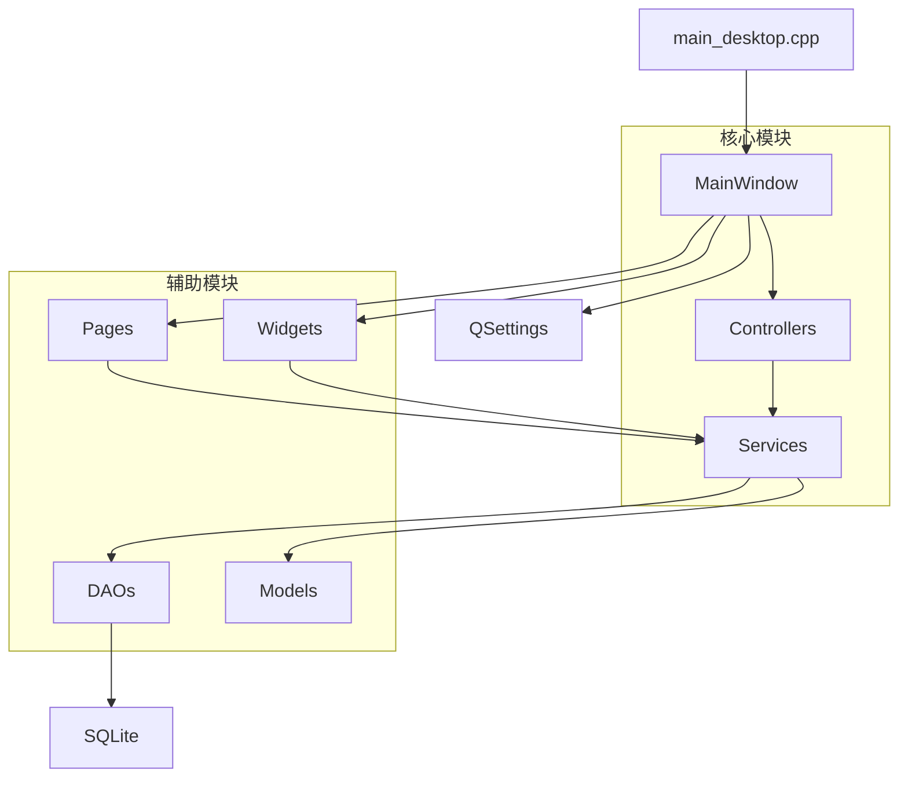

# 系统架构解析文档

## 1. 项目概览

### 1.1 项目名称和功能定位

**学业发展规划系统** (Personal Development Planning System)

这是一个基于 Qt 6 构建的跨平台桌面应用，用于管理学业发展过程中的各类数据，包括课程、目标、角色、成果、经历、活动、岗位等，并提供数据分析、简历生成、AI 辅助等功能。系统同时支持 Vue 3 前端通过 HTTP API 访问后端服务。

### 1.2 应用类型

- **Qt 原生桌面应用**：使用 Qt Widgets 构建的桌面客户端
- **Vue 3 Web 应用**：通过 HTTP API 访问后端服务
- **个人发展规划工具**：帮助用户规划学业发展路径
- **简历编辑器**：支持可视化编辑和多格式导出
- **数据管理工具**：CRUD 操作、数据分析、数据导入

### 1.3 主要用户场景

| 场景 | 描述 |
|------|------|
| 课程管理 | 记录课程信息、计算 GPA、管理学分 |
| 目标追踪 | 设定目标、跟踪进度、管理优先级 |
| 经历记录 | 记录实习、项目、竞赛等经历 |
| 简历生成 | 可视化编辑简历、导出多种格式 |
| 数据分析 | GPA 趋势、学期对比、同学对标 |
| AI 辅助 | 智能分析、建议生成、对话交互 |

### 1.4 主要功能模块

```
┌─────────────────────────────────────────────────────────────┐
│                    学业发展规划系统                          │
├─────────────────────────────────────────────────────────────┤
│  数据管理        │  数据分析      │  简历生成    │  AI 助手  │
│  ─────────────  │  ──────────    │  ────────    │  ──────   │
│  • 课程管理      │  • 总览仪表盘   │  • 可视化编辑 │  • 智能分析│
│  • 目标管理      │  • 学期分析     │  • 实时预览   │  • 对话交互│
│  • 角色管理      │  • 同学对标     │  • 多格式导出 │  • 建议生成│
│  • 成果管理      │  • 时间轴展示   │  • 模板选择   │  • 结果回填│
│  • 经历管理      │                │              │           │
│  • 活动管理      │                │              │           │
│  • 岗位管理      │                │              │           │
│  • 数据导入      │                │              │           │
└─────────────────────────────────────────────────────────────┘
```

### 1.5 技术栈

| 技术 | 版本 | 用途 |
|------|------|------|
| **C++** | 17 | 核心语言 |
| **Qt Widgets** | 6.5+ | UI 框架 |
| **QMainWindow** | - | 主窗口容器 |
| **QWidget** | - | 所有 UI 组件基类 |
| **QLayout** | - | 布局管理 (QVBoxLayout/QHBoxLayout/QGridLayout/QFormLayout) |
| **QSplitter** | - | 可拖动分割布局 |
| **QScrollArea** | - | 滚动区域 |
| **QStackedWidget** | - | 页面堆栈切换 |
| **QSettings** | - | 本地配置持久化 |
| **QFile/QJsonDocument/QJsonObject/QJsonArray** | - | JSON 文件读写 |
| **QSqlDatabase/QSqlQuery** | - | SQLite 数据库操作 |
| **QNetworkAccessManager** | - | HTTP 网络请求 |
| **信号槽机制** | - | 组件间通信 |
| **CMake** | 3.25+ | 构建系统 |
| **MinGW/MSVC** | - | 编译器 |

---

## 2. 目录结构

### 2.1 顶层目录

```
cpp_project/
├── src/                    # 源代码目录
├── docs/                   # 文档目录
├── resources/              # 资源文件
├── frontend_dist/          # 前端构建产物
├── tests/                  # 测试代码
├── CMakeLists.txt          # CMake 配置
├── README.md               # 项目说明
├── VERSION                 # 版本号
├── CHANGELOG.md            # 变更日志
├── ai_server.py            # AI 服务器
└── build_*.bat             # 构建脚本
```

### 2.2 src 目录详解

```
src/
├── client/                 # 桌面客户端 (~11,500 行)
│   ├── core/               # 核心协调器 (6 个文件)
│   │   ├── AppShellController.h/cpp      # 主窗口 Shell 控制器
│   │   ├── DataRefreshCoordinator.h/cpp  # 数据刷新协调器
│   │   ├── BackendRuntimeController.h/cpp# 后端运行时控制器
│   │   ├── AiContextMediator.h/cpp       # AI 上下文中介
│   │   ├── CrudPageController.h/cpp      # CRUD 页面控制器
│   │   └── DataDomain.h                  # 数据域枚举
│   │
│   ├── pages/              # 业务页面 (24 个文件，12 个页面)
│   │   ├── BasePage.h/cpp                # 页面基类
│   │   ├── OverviewPage.h/cpp            # 总览页
│   │   ├── CoursesPage.h/cpp             # 课程页
│   │   ├── RolesPage.h/cpp               # 角色页
│   │   ├── AchievementsPage.h/cpp        # 成果页
│   │   ├── ExperiencesPage.h/cpp         # 经历页
│   │   ├── ActivitiesPage.h/cpp          # 活动页
│   │   ├── GoalsPage.h/cpp               # 目标页
│   │   ├── JobsPage.h/cpp                # 岗位页
│   │   ├── AnalysisPage.h/cpp            # 分析页
│   │   ├── TimelinePage.h/cpp            # 时间轴页
│   │   ├── ResumePage.h/cpp              # 简历页
│   │   └── ImportsPage.h/cpp             # 导入页
│   │
│   ├── widgets/            # UI 组件 (46 个文件，23+ 个组件)
│   │   ├── SidebarWidget.h/cpp           # 侧边栏
│   │   ├── NavigationListWidget.h/cpp    # 导航列表
│   │   ├── AiPanelWidget.h/cpp           # AI 面板
│   │   ├── AiConversationWidget.h/cpp    # AI 对话组件
│   │   ├── AiStatusBar.h/cpp             # AI 状态栏
│   │   ├── ResumePreviewWidget.h/cpp     # 简历预览组件
│   │   ├── ResumePreviewDialog.h/cpp     # 简历预览弹窗
│   │   ├── ResumeEditorPanel.h/cpp       # 简历编辑面板
│   │   ├── ResumeCandidatePanel.h/cpp    # 备选素材面板
│   │   ├── ToastNotification.h/cpp       # Toast 提示
│   │   ├── MetricGridWidget.h/cpp        # 指标网格
│   │   ├── CrudPageShell.h/cpp           # CRUD 页面外壳
│   │   ├── StudentInfoCard.h/cpp         # 学生信息卡片
│   │   ├── TimeInfoCard.h/cpp            # 时间信息卡片
│   │   ├── PeerBenchmarkWidget.h/cpp     # 同学对标组件
│   │   ├── SemesterAnalysisWidget.h/cpp  # 学期分析组件
│   │   └── SuggestionListWidget.h/cpp    # 建议列表组件
│   │
│   ├── dialogs/            # 编辑对话框 (18 个文件，9 个对话框)
│   │   ├── CourseEditorDialog.h/cpp      # 课程编辑
│   │   ├── GoalEditorDialog.h/cpp        # 目标编辑
│   │   ├── RoleEditorDialog.h/cpp        # 角色编辑
│   │   ├── AchievementEditorDialog.h/cpp # 成果编辑
│   │   ├── ExperienceEditorDialog.h/cpp  # 经历编辑
│   │   ├── ActivityEditorDialog.h/cpp    # 活动编辑
│   │   ├── JobEditorDialog.h/cpp         # 岗位编辑
│   │   ├── PeerEditorDialog.h/cpp        # 同学对标编辑
│   │   └── ProfileEditorDialog.h/cpp     # 个人资料编辑
│   │
│   ├── utils/              # UI 工具
│   │   └── UiHelpers.h/cpp               # UI 辅助函数
│   │
│   └── MainWindow.h/cpp    # 主窗口 (766 行)
│
├── service/                # 业务逻辑层 (13 个服务)
│   ├── CourseService.h     # 课程服务
│   ├── GoalService.h       # 目标服务
│   ├── RoleService.h       # 角色服务
│   ├── AchievementService.h# 成果服务
│   ├── ExperienceService.h # 经历服务
│   ├── ActivityService.h   # 活动服务
│   ├── JobService.h        # 岗位服务
│   ├── DashboardService.h  # 仪表盘服务
│   ├── AnalyticsService.h  # 分析服务
│   ├── ResumeService.h     # 简历服务
│   ├── ImportService.h     # 导入服务
│   ├── AuthService.h       # 认证服务
│   └── AiService.h/cpp     # AI 服务
│
├── dao/                    # 数据访问层 (10 个 DAO)
│   ├── DaoBase.h/cpp       # DAO 基类
│   ├── CourseDao.h         # 课程 DAO
│   ├── GoalDao.h           # 目标 DAO
│   ├── RoleDao.h           # 角色 DAO
│   ├── AchievementDao.h    # 成果 DAO
│   ├── ExperienceDao.h     # 经历 DAO
│   ├── ActivityDao.h       # 活动 DAO
│   ├── JobDao.h            # 岗位 DAO
│   ├── UserDao.h           # 用户 DAO
│   └── PeerBenchmarkDao.h  # 同学对标 DAO
│
├── model/                  # 数据模型 (11 个模型)
│   ├── Course.h/cpp        # 课程模型
│   ├── Goal.h              # 目标模型
│   ├── Role.h              # 角色模型
│   ├── Achievement.h       # 成果模型
│   ├── Experience.h        # 经历模型
│   ├── Activity.h          # 活动模型
│   ├── Job.h               # 岗位模型
│   ├── JobRequirement.h    # 岗位需求模型
│   ├── User.h              # 用户模型
│   ├── PeerBenchmark.h     # 同学对标模型
│   ├── ImportResult.h      # 导入结果模型
│   └── ImportErrorItem.h   # 导入错误项模型
│
├── api/                    # HTTP API 层 (14 个 API)
│   ├── CourseApi.h         # 课程 API
│   ├── GoalApi.h           # 目标 API
│   ├── RoleApi.h           # 角色 API
│   ├── AchievementApi.h    # 成果 API
│   ├── ExperienceApi.h     # 经历 API
│   ├── ActivityApi.h       # 活动 API
│   ├── JobApi.h            # 岗位 API
│   ├── DashboardApi.h      # 仪表盘 API
│   ├── AnalyticsApi.h      # 分析 API
│   ├── ResumeApi.h         # 简历 API
│   ├── ImportApi.h         # 导入 API
│   ├── AuthApi.h           # 认证 API
│   ├── AiApi.h             # AI API
│   └── TimelineApi.h       # 时间轴 API
│
├── server/                 # HTTP 服务器
│   └── HttpServer.h        # HTTP 服务器实现
│
├── util/                   # 通用工具
│   ├── Logger.h            # 日志工具
│   └── JsonUtils.h         # JSON 工具
│
├── config/                 # 配置
│   └── Version.h.in        # 版本号模板
│
├── main.cpp                # HTTP 服务器入口
└── main_desktop.cpp        # 桌面客户端入口
```

### 2.3 关键文件职责说明

| 文件 | 职责 | 行数 |
|------|------|------|
| `MainWindow.cpp` | 主窗口，负责 UI 搭建、页面切换、信号连接 | 766 |
| `AppShellController.cpp` | 主窗口 Shell 控制，管理顶部栏和内容宽度 | 80 |
| `DataRefreshCoordinator.cpp` | 数据刷新协调，跨页面刷新联动 | ~100 |
| `BackendRuntimeController.cpp` | 后端服务启动、状态监控、浏览器打开 | ~200 |
| `AiContextMediator.cpp` | AI 上下文中介，捕获选中文本 | ~50 |
| `CrudPageController.cpp` | CRUD 页面通用控制器 | 60 |
| `ResumePage.cpp` | 简历页面，编辑、预览、导出 | ~500 |
| `AiService.cpp` | AI 服务，调用 AI 服务器或后端 API | ~200 |

### 2.4 代码过度集中问题

| 问题 | 状态 | 说明 |
|------|------|------|
| MainWindow 过大 | ✅ 已解决 | 从 5000+ 行重构到 766 行 |
| 样式代码分散 | ⚠️ 存在 | QSS 分散在多个文件中 |
| Lambda 过多 | ⚠️ 存在 | 信号槽连接使用大量 lambda |

---

## 3. 程序启动流程

### 3.1 启动流程图

```
main_desktop.cpp
    │
    ▼
┌─────────────────────────────────────┐
│  QApplication app(argc, argv)       │
│  - 设置应用名称、版本、组织          │
│  - 设置 Fusion 风格 (Windows)        │
└─────────────────────────────────────┘
    │
    ▼
┌─────────────────────────────────────┐
│  initializeDatabase()               │
│  - 添加 SQLite 驱动                  │
│  - 打开 pdp.db 数据库               │
│  - 执行 schema.sql 初始化表结构      │
└─────────────────────────────────────┘
    │
    ▼
┌─────────────────────────────────────┐
│  MainWindow mainWindow              │
│  - 构造函数执行                      │
└─────────────────────────────────────┘
    │
    ▼
┌─────────────────────────────────────┐
│  MainWindow 构造函数内部流程：        │
│                                     │
│  1. 设置窗口标题、大小、最小尺寸      │
│  2. 恢复窗口几何信息 (QSettings)     │
│  3. 创建核心控制器：                 │
│     - AppShellController            │
│     - DataRefreshCoordinator        │
│     - BackendRuntimeController      │
│     - AiContextMediator             │
│  4. setupUi() - 搭建 UI 布局        │
│  5. setupMenuBar() - 创建菜单栏     │
│  6. setupToolBar() - 创建工具栏     │
│  7. setupStatusBar() - 创建状态栏   │
│  8. setupSystemTray() - 创建系统托盘 │
│  9. applyWindowStyle() - 应用样式   │
│  10. 绑定后端控制器到 UI 组件        │
│  11. 检查前端资源是否存在            │
│  12. 启动后端服务器                  │
│  13. 刷新侧边栏数据                  │
│  14. 设置默认页面 (索引 0)           │
│  15. 刷新当前页面                    │
│  16. 插入示例数据（如需要）          │
└─────────────────────────────────────┘
    │
    ▼
┌─────────────────────────────────────┐
│  mainWindow.show()                  │
│  - 显示主窗口                        │
└─────────────────────────────────────┘
    │
    ▼
┌─────────────────────────────────────┐
│  app.exec()                         │
│  - 进入事件循环                      │
│  - 等待用户交互                      │
└─────────────────────────────────────┘
```

### 3.2 setupUi() 详细流程

```
MainWindow::setupUi()
    │
    ├── 创建中央部件和根布局 (QHBoxLayout)
    │
    ├── 创建侧边栏 (SidebarWidget)
    │   └── 包含：导航列表、时间卡片、学生信息卡片
    │
    ├── 创建内容区域 (contentShell)
    │   │
    │   ├── 创建顶部栏 (topbar)
    │   │   └── 包含：标题、副标题、标签
    │   │
    │   └── 创建主内容区 (mainShell)
    │       │
    │       ├── 创建内容容器 (m_mainInner)
    │       │   └── 设置最大宽度 1080px
    │       │
    │       ├── 创建页面堆栈 (QStackedWidget)
    │       │   ├── OverviewPage (索引 0)
    │       │   ├── CoursesPage (索引 1)
    │       │   ├── RolesPage (索引 2)
    │       │   ├── AchievementsPage (索引 3)
    │       │   ├── ExperiencesPage (索引 4)
    │       │   ├── ActivitiesPage (索引 5)
    │       │   ├── GoalsPage (索引 6)
    │       │   ├── JobsPage (索引 7)
    │       │   ├── AnalysisPage (索引 8)
    │       │   ├── TimelinePage (索引 9)
    │       │   ├── ResumePage (索引 10)
    │       │   └── ImportsPage (索引 11)
    │       │
    │       └── 创建滚动区域 (QScrollArea)
    │           └── 包含左右弹性空间实现居中
    │
    ├── 创建 AI 面板 (AiPanelWidget)
    │   └── 包含：对话组件、建议列表、操作按钮
    │
    └── 设置中央部件
```

### 3.3 数据加载流程

```
程序启动
    │
    ├── initializeDatabase()
    │   ├── 打开 SQLite 数据库
    │   └── 执行 schema.sql 创建表
    │
    ├── MainWindow 构造
    │   ├── m_sidebar->refreshData()
    │   │   └── 加载侧边栏统计数据
    │   │
    │   └── refreshCurrentPage()
    │       └── 刷新当前页面数据
    │
    └── 后端服务器启动
        └── onBackendReady() 信号触发
            └── 再次刷新当前页面
```

---

## 4. MainWindow 架构分析

### 4.1 类继承关系

```cpp
class MainWindow : public QMainWindow {
    Q_OBJECT
    // ...
};
```

`MainWindow` 继承自 `QMainWindow`，是 Qt 标准的主窗口类，提供菜单栏、工具栏、状态栏、中央部件等区域。

### 4.2 核心职责

| 职责 | 说明 |
|------|------|
| UI 搭建 | 创建侧边栏、内容区、AI 面板等 UI 组件 |
| 页面管理 | 使用 QStackedWidget 管理多个页面 |
| 导航控制 | 响应导航列表点击，切换页面 |
| 数据刷新 | 协调各页面数据刷新 |
| 后端管理 | 启动、监控后端服务 |
| AI 集成 | 连接 AI 面板与应用逻辑 |
| 系统托盘 | 创建和管理系统托盘图标 |

### 4.3 成员变量分组

#### 主容器类成员

```cpp
QStackedWidget* m_stack = nullptr;      // 页面堆栈
QWidget* m_mainInner = nullptr;         // 内容容器
QSpacerItem* m_leftStretchSpacer = nullptr;  // 左侧弹性空间
QSpacerItem* m_rightStretchSpacer = nullptr; // 右侧弹性空间
```

#### 侧边栏相关成员

```cpp
SidebarWidget* m_sidebar = nullptr;     // 侧边栏组件
```

#### 顶部栏相关成员

```cpp
QLabel* m_topbarKicker = nullptr;       // 顶部副标题
QLabel* m_topbarTitle = nullptr;        // 顶部主标题
QLabel* m_topbarPill = nullptr;         // 顶部标签
```

#### 页面相关成员

```cpp
OverviewPage* m_overviewPage = nullptr;     // 总览页
CoursesPage* m_coursesPage = nullptr;       // 课程页
RolesPage* m_rolesPage = nullptr;           // 角色页
AchievementsPage* m_achievementsPage = nullptr; // 成果页
ExperiencesPage* m_experiencesPage = nullptr;   // 经历页
ActivitiesPage* m_activitiesPage = nullptr; // 活动页
GoalsPage* m_goalsPage = nullptr;           // 目标页
JobsPage* m_jobsPage = nullptr;             // 岗位页
AnalysisPage* m_analysisPage = nullptr;     // 分析页
TimelinePage* m_timelinePage = nullptr;     // 时间轴页
ResumePage* m_resumePage = nullptr;         // 简历页
ImportsPage* m_importsPage = nullptr;       // 导入页
```

#### AI 助手相关成员

```cpp
AiPanelWidget* m_aiPanel = nullptr;     // AI 面板
```

#### 状态栏和工具栏成员

```cpp
QProgressBar* m_progressBar = nullptr;  // 进度条
QLabel* m_statusLabel = nullptr;        // 状态标签
QToolBar* m_toolBar = nullptr;          // 工具栏
```

#### 系统托盘成员

```cpp
QSystemTrayIcon* m_trayIcon = nullptr;  // 系统托盘图标
QMenu* m_trayMenu = nullptr;            // 托盘菜单
QAction* m_openBrowserAction = nullptr; // 打开浏览器动作
QAction* m_quitAction = nullptr;        // 退出动作
QAction* m_refreshAction = nullptr;     // 刷新动作
```

#### 核心控制器成员

```cpp
AppShellController* m_shellController = nullptr;       // Shell 控制器
DataRefreshCoordinator* m_refreshCoordinator = nullptr; // 刷新协调器
BackendRuntimeController* m_backendController = nullptr; // 后端控制器
AiContextMediator* m_aiMediator = nullptr;             // AI 中介
```

### 4.4 重要函数分析

#### UI 创建函数

| 函数 | 作用 | 调用的函数 |
|------|------|-----------|
| `setupUi()` | 创建主界面布局 | 创建侧边栏、页面堆栈、AI 面板 |
| `setupMenuBar()` | 创建菜单栏 | 添加文件菜单、帮助菜单 |
| `setupToolBar()` | 创建工具栏 | 添加刷新、打开浏览器按钮 |
| `setupStatusBar()` | 创建状态栏 | 添加状态标签、进度条 |
| `setupSystemTray()` | 创建系统托盘 | 创建托盘图标、菜单 |
| `applyWindowStyle()` | 应用窗口样式 | 设置全局 QSS 样式 |

#### 数据操作函数

| 函数 | 作用 | 调用的函数 |
|------|------|-----------|
| `refreshCurrentPage()` | 刷新当前页面 | 调用当前页面的 refresh() |
| `onNavigationChanged(int)` | 响应导航切换 | 切换页面、刷新页面 |

#### 事件处理函数

| 函数 | 作用 |
|------|------|
| `closeEvent(QCloseEvent*)` | 处理窗口关闭事件 |
| `onBackendReady()` | 后端就绪回调 |
| `onBackendError(QString)` | 后端错误回调 |
| `onOpenBrowser()` | 打开浏览器 |
| `onAboutTriggered()` | 显示关于对话框 |
| `onTrayActivated(...)` | 托盘图标激活 |
| `onQuitTriggered()` | 退出程序 |

#### AI 相关函数

| 函数 | 作用 |
|------|------|
| AI 面板信号处理 | 处理 AI 分析请求、对话请求 |
| AI 结果回填 | 将 AI 建议写入简历或创建目标 |

---

## 5. 页面组织方式分析

### 5.1 页面切换机制

项目使用 `QStackedWidget` 实现页面切换：

```cpp
// 页面创建和添加
m_stack = new QStackedWidget(this);
m_overviewPage = new OverviewPage(this);
m_stack->addWidget(m_overviewPage);  // 索引 0
m_coursesPage = new CoursesPage(this);
m_stack->addWidget(m_coursesPage);   // 索引 1
// ... 其他页面

// 页面切换
void MainWindow::onNavigationChanged(int row) {
    m_stack->setCurrentIndex(row);
    refreshCurrentPage();
}
```

### 5.2 导航栏创建

```cpp
// SidebarWidget 内部
NavigationListWidget* m_navList = new NavigationListWidget(this);

// 导航项配置
m_labels = {"总览", "课程", "角色", "成果", "经历", "活动", "目标", "岗位", "分析", "时间轴", "简历", "导入"};
m_tooltips = {...};

// 信号连接
connect(m_navList, &QListWidget::currentRowChanged, this, &MainWindow::onNavigationChanged);
```

### 5.3 页面基类结构

```cpp
class BasePage : public QWidget {
    Q_OBJECT
public:
    explicit BasePage(QWidget* parent = nullptr);
    virtual void refresh() = 0;  // 纯虚函数，子类必须实现
protected:
    QFrame* createMetricCard(const QString& labelText, QLabel** valueLabel, const QString& helperText);
};
```

### 5.4 典型页面布局结构

```
BasePage (QWidget)
    │
    └── QVBoxLayout
        │
        ├── 标题区
        │   ├── pageTitle (QLabel)
        │   └── pageSubtitle (QLabel)
        │
        ├── 指标卡片区 (QGridLayout)
        │   └── MetricCard × N
        │
        ├── 操作按钮区 (QHBoxLayout)
        │   └── QPushButton × N
        │
        └── 内容区
            ├── 列表/表格 (QListWidget/QTableWidget)
            └── 或分割布局 (QSplitter)
```

### 5.5 各页面使用的布局

| 页面 | 主布局 | 特殊布局 |
|------|--------|----------|
| OverviewPage | QVBoxLayout | QGridLayout (指标卡片) |
| CoursesPage | QVBoxLayout | CrudPageShell |
| GoalsPage | QVBoxLayout | CrudPageShell |
| ResumePage | QVBoxLayout | QSplitter (编辑器+素材) |
| AnalysisPage | QVBoxLayout | QSplitter (学期+对标) |
| TimelinePage | QVBoxLayout | QSplitter (时间轴+建议) |

### 5.6 页面刷新机制

```cpp
// DataRefreshCoordinator 实现
void DataRefreshCoordinator::refreshByDomain(DataDomain domain) {
    switch (domain) {
    case DataDomain::Courses:
        if (m_courses) m_courses->refresh();
        if (m_overview) m_overview->refresh();
        break;
    case DataDomain::Goals:
        if (m_goals) m_goals->refresh();
        if (m_overview) m_overview->refresh();
        break;
    // ... 其他域
    }
}

void DataRefreshCoordinator::refreshAll() {
    if (m_overview) m_overview->refresh();
    if (m_courses) m_courses->refresh();
    // ... 刷新所有页面
}
```

---

## 6. UI 组件与样式系统

### 6.1 整体视觉风格

- **卡片式布局**：使用 `QFrame` 配合 `setObjectName("contentCard")` 实现卡片效果
- **Material Design 风格**：圆角、阴影、层次感
- **暖色调配色**：米白色背景 (#fffdf9)、棕色边框 (#ddcfbe)

### 6.2 统一样式定义

```cpp
// MainWindow::applyWindowStyle() 中的全局样式
QString style = R"(
    /* 侧边栏样式 */
    #sidebar { background: #f8f5f0; border-right: 1px solid #e8e0d5; }
    
    /* 卡片样式 */
    #contentCard { background: #fffdf9; border: 1px solid #ddcfbe; border-radius: 14px; }
    
    /* 页面标题 */
    #pageTitle { color: #2d241c; font-size: 22px; font-weight: 700; }
    
    /* 按钮样式 */
    QPushButton { background: #f4ede2; border: 1px solid #d7cab8; border-radius: 8px; padding: 8px 16px; }
    QPushButton:hover { background: #ebe3d6; }
    
    /* 输入框样式 */
    QLineEdit, QTextEdit { background: #fff; border: 1px solid #d7cab8; border-radius: 6px; padding: 8px; }
)";
```

### 6.3 组件封装情况

| 组件 | 封装状态 | 说明 |
|------|----------|------|
| SidebarWidget | ✅ 已封装 | 侧边栏组件 |
| NavigationListWidget | ✅ 已封装 | 导航列表组件 |
| AiPanelWidget | ✅ 已封装 | AI 面板组件 |
| ToastNotification | ✅ 已封装 | Toast 提示组件 |
| ResumePreviewWidget | ✅ 已封装 | 简历预览组件 |
| ResumePreviewDialog | ✅ 已封装 | 简历预览弹窗 |
| MetricGridWidget | ✅ 已封装 | 指标网格组件 |
| CrudPageShell | ✅ 已封装 | CRUD 页面外壳 |
| StudentInfoCard | ✅ 已封装 | 学生信息卡片 |
| TimeInfoCard | ✅ 已封装 | 时间信息卡片 |

### 6.4 样式问题分析

| 问题 | 状态 | 说明 |
|------|------|------|
| 样式硬编码 | ⚠️ 存在 | 大量 QSS 字符串直接写在代码中 |
| 样式分散 | ⚠️ 存在 | 样式分散在多个文件中 |
| 颜色变量缺失 | ⚠️ 存在 | 没有统一的颜色常量定义 |
| 主题切换不支持 | ❌ 缺失 | 没有深色模式支持 |

### 6.5 推荐优化方向

1. **抽取 ThemeManager 类**：统一管理颜色、字体、尺寸
2. **使用 QSS 文件**：将样式从代码中分离
3. **创建 UIComponents 工厂**：统一创建按钮、输入框等组件

---

## 7. 数据模型分析

### 7.1 模型类列表

| 模型 | 文件 | 主要字段 |
|------|------|----------|
| Course | Course.h/cpp | id, name, code, credits, score, gradePoint, semester, status |
| Goal | Goal.h | id, title, category, description, targetValue, currentValue, unit, deadline, priority, status |
| Role | Role.h | id, title, type, organization, startDate, endDate, isActive |
| Achievement | Achievement.h | id, title, type, level, date, description, verified |
| Experience | Experience.h | id, title, type, organization, startDate, endDate, description |
| Activity | Activity.h | id, name, category, startDate, endDate, description, isFavorite |
| Job | Job.h | id, title, company, location, requirements, status, deadline |
| JobRequirement | JobRequirement.h | id, jobId, requirement, isMet |
| User | User.h | id, username, email, passwordHash |
| PeerBenchmark | PeerBenchmark.h | id, name, major, semester, gpa, credits |
| ImportResult | ImportResult.h | imported, failed, errors |
| ImportErrorItem | ImportErrorItem.h | row, message |

### 7.2 模型字段示例 (Goal)

```cpp
class Goal {
public:
    int id = 0;
    QString title;
    QString category;
    QString description;
    double targetValue = 0;
    double currentValue = 0;
    QString unit;
    QString deadline;
    QString priority = "Medium";
    QString status = "In Progress";
    QString milestones;
    QDateTime createdAt;
    QDateTime updatedAt;
    
    // 计算属性
    double progress() const;
    
    // JSON 序列化
    QJsonObject toDict() const;
    static Goal fromDict(const QJsonObject& obj);
};
```

### 7.3 JSON 序列化机制

```cpp
QJsonObject Goal::toDict() const {
    QJsonObject obj;
    obj["id"] = id;
    obj["title"] = title;
    obj["category"] = category;
    obj["description"] = description;
    obj["targetValue"] = targetValue;
    obj["currentValue"] = currentValue;
    obj["unit"] = unit;
    obj["deadline"] = deadline;
    obj["priority"] = priority;
    obj["status"] = status;
    obj["progress"] = progress();
    obj["createdAt"] = createdAt.toString(Qt::ISODate);
    obj["updatedAt"] = updatedAt.toString(Qt::ISODate);
    return obj;
}

Goal Goal::fromDict(const QJsonObject& obj) {
    Goal g;
    g.id = obj["id"].toInt();
    g.title = obj["title"].toString();
    // ... 其他字段
    return g;
}
```

### 7.4 模型关系

```
User
  │
  ├── Course (用户课程)
  ├── Goal (用户目标)
  ├── Role (用户角色)
  ├── Achievement (用户成果)
  ├── Experience (用户经历)
  ├── Activity (用户活动)
  └── Job (用户岗位)
        │
        └── JobRequirement (岗位需求)
```

### 7.5 模型设计问题

| 问题 | 状态 | 说明 |
|------|------|------|
| 字段命名不统一 | ⚠️ 存在 | 部分使用驼峰，部分使用下划线 |
| 缺少数据校验 | ⚠️ 存在 | 没有字段有效性检查 |
| 模型与 UI 耦合 | ⚠️ 存在 | 部分模型包含 UI 相关逻辑 |

---

## 8. 服务层分析

### 8.1 服务类列表

| 服务 | 文件 | 职责 |
|------|------|------|
| CourseService | CourseService.h | 课程 CRUD、GPA 计算、学分统计 |
| GoalService | GoalService.h | 目标 CRUD、进度统计 |
| RoleService | RoleService.h | 角色 CRUD |
| AchievementService | AchievementService.h | 成果 CRUD |
| ExperienceService | ExperienceService.h | 经历 CRUD |
| ActivityService | ActivityService.h | 活动 CRUD |
| JobService | JobService.h | 岗位 CRUD、需求匹配 |
| DashboardService | DashboardService.h | 仪表盘数据汇总 |
| AnalyticsService | AnalyticsService.h | 学期分析、对标分析 |
| ResumeService | ResumeService.h | 简历生成、导出 |
| ImportService | ImportService.h | CSV 数据导入 |
| AuthService | AuthService.h | 用户认证 |
| AiService | AiService.h/cpp | AI 分析、对话 |

### 8.2 服务层设计模式

```cpp
// 典型服务类设计 (GoalService)
class GoalService {
public:
    static QList<Goal> getAll();
    static Goal getById(int id);
    static Goal create(Goal& g);
    static Goal update(int id, Goal& g);
    static bool remove(int id);
    static QJsonObject getStatistics();
};
```

**特点**：
- 全部使用静态方法
- 直接调用 DAO 层
- 无状态设计

### 8.3 服务层与 DAO 层关系

```
Service 层
    │
    ├── 调用 DAO 层进行数据访问
    ├── 封装业务逻辑
    ├── 提供统计和计算功能
    └── 返回模型对象或 JSON
        │
        ▼
DAO 层
    │
    ├── 继承 DaoBase
    ├── 使用 QSqlQuery 操作数据库
    └── 返回模型对象
```

### 8.4 AiService 特殊设计

```cpp
class AiService {
public:
    // 分析接口
    static QJsonObject analyze(const QJsonObject& data);
    static QJsonObject chat(const QJsonObject& data);
    
    // 配置接口
    static void setAiServerUrl(const QString& url);
    static void setBackendUrl(const QString& url);
    
    // 状态检查
    static bool isAiServerAvailable(bool forceRefresh = false);
    static QString currentMode();  // "rule" or "remote"
    
private:
    // 内部调用
    static QJsonObject callAiServer(const QString& endpoint, const QJsonObject& data);
    static QJsonObject callBackendApi(const QString& endpoint, const QJsonObject& data);
};
```

**特点**：
- 支持两种模式：规则引擎模式 / 远程 AI 模式
- 自动检测 AI 服务器可用性
- 失败时回退到规则引擎

### 8.5 服务层问题

| 问题 | 状态 | 说明 |
|------|------|------|
| 服务与 UI 耦合 | ⚠️ 部分 | 部分服务直接被 UI 调用 |
| 缺少接口抽象 | ⚠️ 存在 | 没有 IService 接口 |
| 缺少依赖注入 | ⚠️ 存在 | 服务直接静态调用 |
| 可测试性一般 | ⚠️ 存在 | 静态方法难以 Mock |

---

## 9. 持久化机制分析

### 9.1 持久化方式

| 方式 | 用途 | 文件/路径 |
|------|------|-----------|
| SQLite | 核心业务数据 | pdp.db |
| QSettings | 用户配置、窗口状态 | 注册表/配置文件 |
| JSON 文件 | 简历导出 | 用户指定路径 |

### 9.2 SQLite 数据库

#### 数据库初始化

```cpp
// main_desktop.cpp
bool initializeDatabase() {
    QSqlDatabase db = QSqlDatabase::addDatabase("QSQLITE");
    db.setDatabaseName(QDir::currentPath() + "/pdp.db");
    if (!db.open()) return false;
    
    // 执行 schema.sql
    QFile schemaFile(":/resources/schema.sql");
    // ...
}
```

#### 数据库表结构

| 表名 | 说明 | 主要字段 |
|------|------|----------|
| courses | 课程信息 | id, name, code, credits, score, grade_point, semester, status |
| goals | 目标管理 | id, title, category, target_value, current_value, status |
| roles | 角色信息 | id, title, type, organization, is_active |
| achievements | 成果记录 | id, title, type, level, date, verified |
| experiences | 经历记录 | id, title, type, organization, start_date, end_date |
| activities | 活动记录 | id, name, category, start_date, end_date, is_favorite |
| jobs | 岗位信息 | id, title, company, location, status, deadline |
| job_requirements | 岗位需求 | id, job_id, requirement, is_met |
| users | 用户信息 | id, username, email, password_hash |
| peer_benchmarks | 同学对标 | id, name, major, semester, gpa, credits |

### 9.3 QSettings 配置

```cpp
// 保存配置
QSettings settings;
settings.setValue("geometry", saveGeometry());
settings.setValue("profile/name", name);
settings.setValue("profile/avatar", avatarPath);

// 读取配置
QSettings settings;
QByteArray geometry = settings.value("geometry").toByteArray();
QString name = settings.value("profile/name", "默认名称").toString();
```

#### QSettings 存储内容

| 键 | 类型 | 说明 |
|------|------|------|
| geometry | QByteArray | 窗口几何信息 |
| profile/name | QString | 用户姓名 |
| profile/title | QString | 身份标题 |
| profile/email | QString | 邮箱 |
| profile/phone | QString | 电话 |
| profile/avatar | QString | 头像路径 |
| profile/summary | QString | 个人简介 |
| profile/customContent | QString | 自定义内容 |

### 9.4 数据保存时机

| 场景 | 保存方式 | 说明 |
|------|------|------|
| 窗口关闭 | 自动保存 | 保存窗口几何信息 |
| 编辑完成 | 防抖保存 | 300ms 延迟后保存 |
| 添加/修改/删除 | 立即保存 | 数据库事务 |
| 简历导出 | 手动触发 | 用户选择路径 |

### 9.5 持久化问题

| 问题 | 状态 | 说明 |
|------|------|------|
| 无自动保存 | ⚠️ 存在 | 编辑后需手动触发保存 |
| 无数据备份 | ⚠️ 存在 | 没有数据备份机制 |
| 无版本迁移 | ⚠️ 存在 | Schema 变更无迁移脚本 |

---

## 10. 信号槽与交互流程分析

### 10.1 主要信号槽连接

#### 导航切换

```cpp
connect(m_sidebar->navigationList(), &QListWidget::currentRowChanged,
        this, &MainWindow::onNavigationChanged);
```

#### 后端状态

```cpp
connect(m_backendController, &BackendRuntimeController::backendReady,
        this, &MainWindow::onBackendReady);
connect(m_backendController, &BackendRuntimeController::serverError,
        this, &MainWindow::onBackendError);
```

#### AI 面板交互

```cpp
connect(m_aiPanel, &AiPanelWidget::applyToResumeRequested, this, [this](const QString& summary) {
    // 将 AI 建议写入简历
});

connect(m_aiPanel, &AiPanelWidget::createGoalRequested, this, [this](const QString& title, const QString& description) {
    // 根据 AI 建议创建目标
});

connect(m_aiPanel, &AiPanelWidget::analysisRequested, this, [this](const QString& type) {
    // 执行 AI 分析
});

connect(m_aiPanel, &AiPanelWidget::chatMessageSent, this, [this](const QString& message) {
    // 发送对话消息
});
```

### 10.2 数据变更刷新流程

```
用户操作 (添加/修改/删除)
    │
    ▼
Service 层执行操作
    │
    ▼
emit dataChanged(DataDomain)
    │
    ▼
DataRefreshCoordinator::refreshByDomain()
    │
    ├── 刷新相关页面
    │   ├── m_courses->refresh()
    │   └── m_overview->refresh()
    │
    └── 更新侧边栏统计
        └── m_sidebar->refreshData()
```

### 10.3 简历编辑防抖保存

```cpp
// ResumePage 构造函数
m_updateTimer = new QTimer(this);
m_updateTimer->setSingleShot(true);
m_updateTimer->setInterval(300);
connect(m_updateTimer, &QTimer::timeout, this, &ResumePage::updatePreview);

// 编辑时触发
void ResumePage::onOptionsChanged() {
    saveOptions();
    m_updateTimer->start();  // 300ms 后刷新预览
}
```

### 10.4 信号槽问题

| 问题 | 状态 | 说明 |
|------|------|------|
| Lambda 过多 | ⚠️ 存在 | 大量使用 lambda 连接信号槽 |
| 连接分散 | ⚠️ 存在 | 信号槽连接分散在多处 |
| 命名不统一 | ⚠️ 存在 | 槽函数命名风格不一致 |

---

## 11. 模块依赖关系分析

### 11.1 分层架构图

```
┌─────────────────────────────────────────────────────────────┐
│                      表现层 (Presentation)                   │
│  ┌──────────────────────────────────────────────────────┐  │
│  │  MainWindow                                           │  │
│  │  ├── Pages (OverviewPage, CoursesPage, ...)          │  │
│  │  ├── Widgets (SidebarWidget, AiPanelWidget, ...)     │  │
│  │  └── Dialogs (CourseEditorDialog, GoalEditorDialog, ...)│
│  └──────────────────────────────────────────────────────┘  │
└─────────────────────────────────────────────────────────────┘
                              │
                              ▼
┌─────────────────────────────────────────────────────────────┐
│                      控制层 (Controller)                     │
│  ┌──────────────────────────────────────────────────────┐  │
│  │  AppShellController      - 主窗口 Shell 控制          │  │
│  │  DataRefreshCoordinator  - 数据刷新协调               │  │
│  │  BackendRuntimeController- 后端运行时控制             │  │
│  │  AiContextMediator       - AI 上下文中介              │  │
│  │  CrudPageController      - CRUD 页面控制器            │  │
│  └──────────────────────────────────────────────────────┘  │
└─────────────────────────────────────────────────────────────┘
                              │
                              ▼
┌─────────────────────────────────────────────────────────────┐
│                      服务层 (Service)                        │
│  ┌──────────────────────────────────────────────────────┐  │
│  │  CourseService, GoalService, RoleService, ...        │  │
│  │  AiService, ResumeService, ImportService, ...        │  │
│  └──────────────────────────────────────────────────────┘  │
└─────────────────────────────────────────────────────────────┘
                              │
                              ▼
┌─────────────────────────────────────────────────────────────┐
│                      数据访问层 (DAO)                        │
│  ┌──────────────────────────────────────────────────────┐  │
│  │  DaoBase, CourseDao, GoalDao, RoleDao, ...           │  │
│  └──────────────────────────────────────────────────────┘  │
└─────────────────────────────────────────────────────────────┘
                              │
                              ▼
┌─────────────────────────────────────────────────────────────┐
│                      数据层 (Data)                           │
│  ┌──────────────────────────────────────────────────────┐  │
│  │  SQLite (pdp.db)  │  QSettings  │  JSON Files        │  │
│  └──────────────────────────────────────────────────────┘  │
└─────────────────────────────────────────────────────────────┘
```

### 11.2 模块依赖关系 (Mermaid)



### 11.3 核心模块与辅助模块

| 类型 | 模块 | 说明 |
|------|------|------|
| 核心 | MainWindow | 应用入口和主窗口 |
| 核心 | Controllers | 业务协调和控制 |
| 核心 | Services | 业务逻辑封装 |
| 辅助 | Pages | 页面展示 |
| 辅助 | Widgets | UI 组件 |
| 辅助 | DAOs | 数据访问 |
| 辅助 | Models | 数据模型 |

### 11.4 耦合问题分析

| 耦合点 | 程度 | 说明 |
|------|------|------|
| MainWindow ↔ Pages | 中 | MainWindow 直接持有所有页面实例 |
| Pages ↔ Services | 中 | 页面直接调用 Service 静态方法 |
| Widgets ↔ Services | 低 | 大部分组件不直接调用 Service |
| Controllers ↔ Services | 低 | 控制器协调页面，不直接调用 Service |

---

## 12. 当前架构优点

### 12.1 功能模块完整

- ✅ 覆盖学业发展规划的核心场景
- ✅ 12 个功能页面，各司其职
- ✅ 数据管理、分析、简历、AI 助手形成闭环

### 12.2 页面入口清晰

- ✅ 左侧导航栏，页面切换直观
- ✅ QStackedWidget 管理页面，切换流畅
- ✅ 页面索引固定，易于维护

### 12.3 Qt 原生控件

- ✅ 使用 Qt Widgets，性能优秀
- ✅ 跨平台支持 (Windows/macOS/Linux)
- ✅ 无需额外依赖

### 12.4 本地持久化

- ✅ SQLite 数据库，离线可用
- ✅ QSettings 保存配置
- ✅ 数据安全，无需网络

### 12.5 AI 扩展空间

- ✅ 已集成 AI 服务接口
- ✅ 支持规则引擎和远程 AI 两种模式
- ✅ AI 结果可回填到简历和目标

### 12.6 简历功能完整

- ✅ 可视化编辑
- ✅ 实时预览
- ✅ 多格式导出 (JSON/HTML)

### 12.7 适合项目展示

- ✅ 代码量适中 (~15,200 行)
- ✅ 功能完整，演示效果好
- ✅ 架构清晰，易于讲解

---

## 13. 当前架构问题

### 13.1 代码组织问题

| 问题 | 严重程度 | 说明 |
|------|----------|------|
| 样式代码分散 | P1 | QSS 分散在多个文件中，难以统一维护 |
| Lambda 过多 | P2 | 信号槽连接大量使用 lambda，难以追踪 |
| 部分函数过长 | P2 | 个别函数超过 100 行 |

### 13.2 架构设计问题

| 问题 | 严重程度 | 说明 |
|------|----------|------|
| 缺少接口抽象 | P1 | Service 和 DAO 没有接口定义 |
| 缺少依赖注入 | P2 | 服务直接静态调用，难以测试 |
| 模型与 UI 耦合 | P2 | 部分模型包含 UI 相关逻辑 |

### 13.3 数据持久化问题

| 问题 | 严重程度 | 说明 |
|------|----------|------|
| 无自动保存 | P1 | 编辑后需手动触发保存 |
| 无数据备份 | P2 | 没有数据备份机制 |
| 无版本迁移 | P2 | Schema 变更无迁移脚本 |

### 13.4 测试与质量

| 问题 | 严重程度 | 说明 |
|------|----------|------|
| 缺少单元测试 | P1 | 测试覆盖率极低 |
| 缺少错误处理 | P2 | 部分操作无错误提示 |
| 缺少数据校验 | P2 | 输入数据无有效性检查 |

### 13.5 用户体验

| 问题 | 严重程度 | 说明 |
|------|----------|------|
| 无深色模式 | P3 | 不支持主题切换 |
| 无国际化 | P3 | 不支持多语言 |
| 无快捷键提示 | P3 | 部分快捷键无提示 |

---

## 14. 后续优化建议

### 14.1 P0 - 必须优先修复

| 建议 | 说明 | 预估工作量 |
|------|------|-----------|
| 添加单元测试 | 为 Service 和 DAO 层添加测试 | 3-5 天 |
| 实现自动保存 | 编辑后自动保存，防止数据丢失 | 1 天 |
| 统一错误处理 | 添加全局错误处理和用户提示 | 1-2 天 |

### 14.2 P1 - 影响维护性的结构问题

| 建议 | 说明 | 预估工作量 |
|------|------|-----------|
| 抽取 ThemeManager | 统一管理颜色、字体、尺寸 | 2 天 |
| 抽取 UIComponents 工厂 | 统一创建按钮、输入框等组件 | 2 天 |
| 添加接口抽象 | 为 Service 和 DAO 定义接口 | 3 天 |
| 实现依赖注入 | 使用依赖注入容器管理服务 | 2 天 |

### 14.3 P2 - 体验优化

| 建议 | 说明 | 预估工作量 |
|------|------|-----------|
| 添加数据备份 | 支持数据导出和恢复 | 1 天 |
| 添加 Schema 迁移 | 数据库版本管理 | 2 天 |
| 添加数据校验 | 输入数据有效性检查 | 1 天 |
| 优化 Lambda 使用 | 将复杂 lambda 提取为槽函数 | 2 天 |

### 14.4 P3 - 长期架构升级

| 建议 | 说明 | 预估工作量 |
|------|------|-----------|
| 支持深色模式 | 主题切换功能 | 3 天 |
| 支持国际化 | 多语言支持 | 5 天 |
| 添加云同步 | 数据云端备份 | 7 天 |
| 移动端适配 | 响应式布局 | 10 天 |

---

## 15. 新开发者阅读路线

### 15.1 入门阶段 (1-2 天)

1. **阅读 README.md**：了解项目概述、功能、技术栈
2. **阅读本文档**：理解整体架构
3. **编译运行项目**：熟悉开发环境
4. **体验所有功能**：理解用户场景

### 15.2 理解阶段 (3-5 天)

1. **阅读 main_desktop.cpp**：理解启动流程
2. **阅读 MainWindow.cpp**：理解主窗口结构
3. **阅读一个简单页面**：如 CoursesPage
4. **阅读对应的 Service 和 DAO**：理解数据流
5. **阅读对应的 Model**：理解数据结构

### 15.3 实践阶段 (5-7 天)

1. **修改一个页面样式**：熟悉 QSS
2. **添加一个新字段**：熟悉 Model/DAO/Service
3. **添加一个新功能**：如筛选、排序
4. **修复一个 Bug**：熟悉调试流程

### 15.4 进阶阶段 (持续)

1. **添加新页面**：完整的功能开发
2. **重构代码**：优化架构
3. **添加测试**：提高代码质量
4. **贡献文档**：完善项目文档

---

## 16. 总结

### 16.1 项目现状

学业发展规划系统是一个功能完整的 Qt 桌面应用，采用 6 层架构设计：

1. **表现层**：MainWindow + Pages + Widgets + Dialogs
2. **控制层**：AppShellController + DataRefreshCoordinator + ...
3. **服务层**：CourseService + GoalService + AiService + ...
4. **数据访问层**：DaoBase + CourseDao + GoalDao + ...
5. **模型层**：Course + Goal + Role + ...
6. **数据层**：SQLite + QSettings + JSON

### 16.2 架构评价

| 维度 | 评分 | 说明 |
|------|------|------|
| 功能完整性 | ⭐⭐⭐⭐⭐ | 覆盖核心场景，功能丰富 |
| 代码组织 | ⭐⭐⭐⭐ | 从单体重构到模块化，结构清晰 |
| 可维护性 | ⭐⭐⭐⭐ | 分层清晰，职责明确 |
| 可测试性 | ⭐⭐⭐ | 缺少单元测试 |
| 可扩展性 | ⭐⭐⭐⭐ | 架构支持扩展 |
| 用户体验 | ⭐⭐⭐⭐ | 界面美观，交互流畅 |

### 16.3 核心优势

1. **架构清晰**：6 层分层，职责明确
2. **功能完整**：数据管理、分析、简历、AI 形成闭环
3. **技术成熟**：Qt 6 + SQLite，稳定可靠
4. **代码精简**：MainWindow 从 5000+ 行重构到 766 行

### 16.4 主要挑战

1. **测试覆盖**：需要补充单元测试
2. **样式管理**：需要统一样式管理机制
3. **数据安全**：需要添加自动保存和备份
4. **国际化**：需要支持多语言

### 16.5 发展方向

1. **短期**：完善测试、优化体验、修复 Bug
2. **中期**：重构样式系统、添加云同步
3. **长期**：支持移动端、集成 LLM、多用户支持

---

**文档版本**: v1.1  
**生成日期**: 2026-04-29  
**适用项目版本**: v0.3.0  
**最后更新**: 根据项目实际代码同步更新
