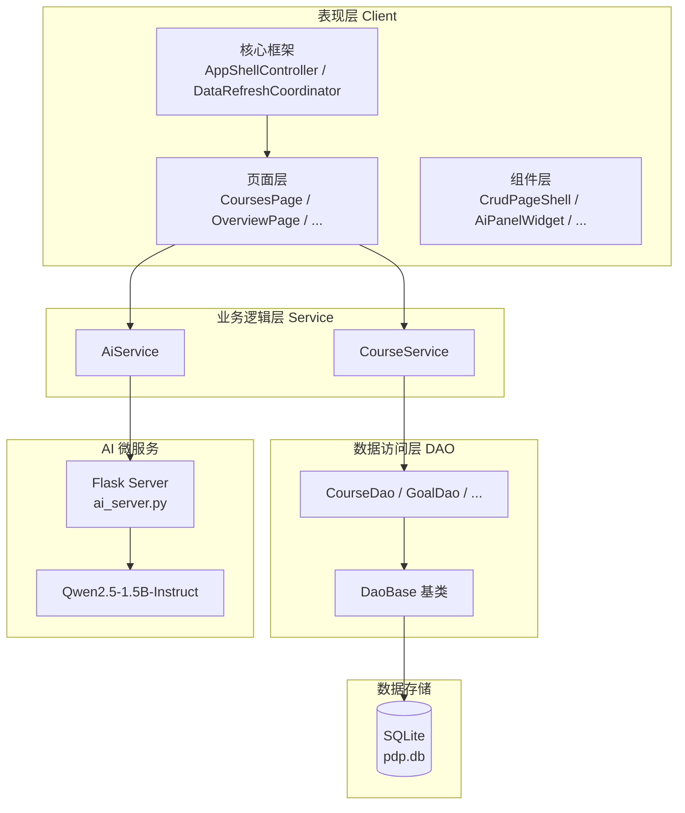
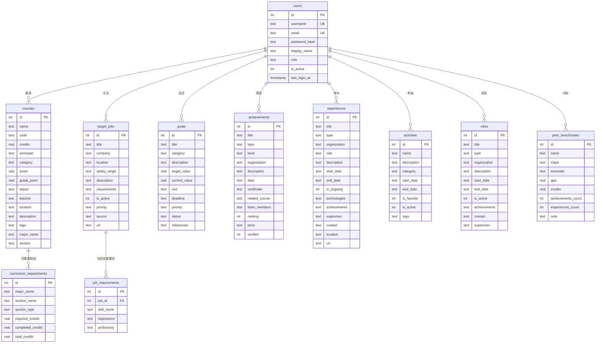
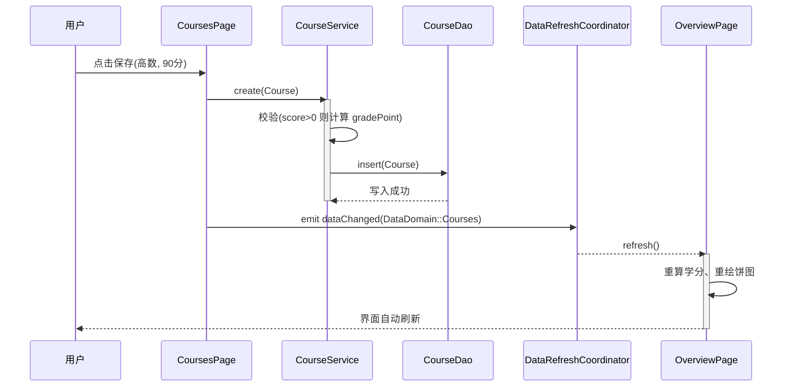

# 学业发展规划系统 — 软件设计报告

---

| 项目 | 内容 |
| :--- | :--- |
| **系统名称** | 学业发展规划系统（Personal Development Planner） |
| **版本号** | V1.0 |
| **编写日期** | 2026-06-20 |
| **密级** | 内部 |

---

## 修订记录

| 序号 | 版本 | 日期 | 修改章节 | 修改说明 |
| :--- | :--- | :--- | :--- | :--- |
| 1 | V1.0 | 2026-06-20 | 全文 | 初始版本，依据 GB/T 9385-2008 规范编写 |

---

## 目录

- [1 引言](#1-引言)
  - [1.1 编写目的](#11-编写目的)
  - [1.2 项目范围](#12-项目范围)
  - [1.3 术语与缩略语](#13-术语与缩略语)
  - [1.4 参考资料](#14-参考资料)
- [2 系统概述](#2-系统概述)
  - [2.1 设计目标](#21-设计目标)
  - [2.2 设计约束](#22-设计约束)
  - [2.3 架构风格](#23-架构风格)
- [3 总体架构设计](#3-总体架构设计)
  - [3.1 分层架构](#31-分层架构)
  - [3.2 双模部署架构](#32-双模部署架构)
  - [3.3 技术选型](#33-技术选型)
- [4 模块设计](#4-模块设计)
  - [4.1 数据访问层（DAO）](#41-数据访问层dao)
  - [4.2 业务逻辑层（Service）](#42-业务逻辑层service)
  - [4.3 用户界面层（Client）](#43-用户界面层client)
  - [4.4 API 网关层](#44-api-网关层)
  - [4.5 工具模块](#45-工具模块)
- [5 数据库设计](#5-数据库设计)
  - [5.1 ER 图](#51-er-图)
  - [5.2 数据字典](#52-数据字典)
- [6 接口设计](#6-接口设计)
  - [6.1 内部接口：信号与槽](#61-内部接口信号与槽)
  - [6.2 外部接口：REST API](#62-外部接口rest-api)
- [7 UI 设计](#7-ui-设计)
  - [7.1 页面导航结构](#71-页面导航结构)
  - [7.2 核心交互流程](#72-核心交互流程)
  - [7.3 关键 UI 组件](#73-关键-ui-组件)
- [8 安全设计](#8-安全设计)
  - [8.1 输入验证](#81-输入验证)
  - [8.2 数据安全](#82-数据安全)
  - [8.3 日志审计](#83-日志审计)
  - [8.4 访问控制](#84-访问控制)
- [9 运行环境与部署](#9-运行环境与部署)
  - [9.1 编译环境](#91-编译环境)
  - [9.2 Python AI 后端环境](#92-python-ai-后端环境)
  - [9.3 数据库初始化](#93-数据库初始化)
  - [9.4 双模启动方式](#94-双模启动方式)
- [10 设计验证](#10-设计验证)
  - [10.1 测试策略](#101-测试策略)
  - [10.2 验收标准](#102-验收标准)
- [11 已知限制与未来工作](#11-已知限制与未来工作)
- [参考文献](#参考文献)

---

## 1 引言

### 1.1 编写目的

本文档依据 GB/T 9385-2008《计算机软件需求规格说明规范》及 GB/T 8567-2006《计算机软件文档编制规范》，对"学业发展规划系统"的软件设计进行完整记录。文档面向以下读者：

- **评审教师**：了解系统架构决策、模块划分与技术实现的合规性；
- **后续开发者**：获取源码导航、模块职责与接口契约，降低接手成本。

### 1.2 项目范围

本系统是一款基于 Qt 6 / C++17 的桌面应用程序，用于管理大学生在校期间的课程成绩、荣誉奖项、项目经历、活动记录、职业目标等个人学业档案，并提供 GPA 统计、学分分析、简历生成和 AI 智能辅助等功能。

系统包含两个独立的可执行程序：
- `pdp_desktop.exe`：带 GUI 的桌面客户端；
- `pdp_server.exe`：无头（Headless）HTTP 服务端，可独立部署。

### 1.3 术语与缩略语

| 术语 | 说明 |
| :--- | :--- |
| DAO | Data Access Object，数据访问对象 |
| SPA | Single Page Application，单页应用模式 |
| GPA | Grade Point Average，绩点 |
| MVC | Model-View-Controller，模型-视图-控制器 |
| TLS | Thread-Local Storage，线程局部存储 |
| ADR | Architecture Decision Record，架构决策记录 |

### 1.4 参考资料

1. GB/T 9385-2008，计算机软件需求规格说明规范
2. GB/T 8567-2006，计算机软件文档编制规范
3. Qt 6 官方文档，https://doc.qt.io/qt-6/
4. SQLite 官方文档，https://www.sqlite.org/docs.html
5. Qwen2.5 技术报告，https://github.com/QwenLM/Qwen2.5
6. Flask 官方文档，https://flask.palletsprojects.com/

---

## 2 系统概述

### 2.1 设计目标

1. **功能目标**：提供课程管理、荣誉记录、项目经历、活动日志、职业目标追踪、AI 智能分析、简历生成等完整的学业档案管理能力。
2. **性能目标**：主界面页面切换响应时间 < 100ms；1000 条课程记录的列表渲染无明显卡顿。
3. **可用性目标**：提供向导式数据导入、非阻塞 Toast 提示、侧滑 AI 面板等现代化交互范式，降低学习成本。
4. **可维护性目标**：严格分层（DAO / Service / View），各层可独立测试和替换。

### 2.2 设计约束

1. **技术约束**：使用 C++17 标准、Qt 6.4+ 框架、MSVC 2019/2022 编译器。
2. **运行约束**：桌面端仅支持 Windows 平台；AI 后端需 Python 3.10+ 环境。
3. **存储约束**：采用 SQLite 单文件数据库，适合单机部署场景。
4. **依赖约束**：Qt 6 HttpServer 模块（6.4+ 方稳定）、Transformers / PyTorch（AI 后端）。

### 2.3 架构风格

本系统采用**分层架构（Layered Architecture）**，辅以**事件驱动（Event-Driven）**的数据刷新机制：

- **表现层**（Client）：页面（Page）与可复用组件（Widget）；
- **业务逻辑层**（Service）：无状态静态工具类，封装校验与计算；
- **数据访问层**（DAO）：隔离 SQL 操作，提供类型安全的 CRUD 接口；
- **事件总线**（DataRefreshCoordinator）：基于 Qt 信号槽的中介者，解耦页面间的数据刷新依赖。

---

## 3 总体架构设计

### 3.1 分层架构



### 3.2 双模部署架构

系统通过 CMake 的构建目标分离，实现两种部署模式：

| 模式 | 可执行文件 | 链接模块 | 适用场景 |
| :--- | :--- | :--- | :--- |
| 桌面模式 | `pdp_desktop.exe` | Qt6::Widgets, Qt6::HttpServer, Qt6::PrintSupport | 本地桌面使用 |
| 服务模式 | `pdp_server.exe` | Qt6::HttpServer, Qt6::Sql（无 Widgets） | Linux 容器 / 无头服务器 |

两者共享 DAO 层与 Service 层的源码（`PDP_COMMON_SOURCES`），仅入口文件和 UI 层不同。

### 3.3 技术选型

| 层次 | 技术 | 选型理由 |
| :--- | :--- | :--- |
| 语言 | C++17 | 强类型、内存可控、编译期错误检查 |
| UI 框架 | Qt 6.4+ | 跨平台、信号槽机制、丰富的 Widgets |
| 数据库 | SQLite | 零配置、单文件、适合桌面场景 |
| HTTP 服务 | Qt6::HttpServer | 与 Qt 生态一致，支持同进程部署 |
| AI 后端 | Flask + Qwen2.5-1.5B-Instruct | 轻量级 Web 框架 + 本地部署的中文化大模型 |
| 构建系统 | CMake 3.25+ | 支持多目标分离、条件编译 |

---

## 4 模块设计

### 4.1 数据访问层（DAO）

#### 4.1.1 DaoBase 基类

`DaoBase` 是一个 header-only 的极简基类，所有具体 DAO 类均继承自它。

```cpp
// src/dao/DaoBase.h
class DaoBase {
public:
    DaoBase() : m_db(QSqlDatabase::database()) {
        if (!m_db.isOpen()) {
            Logger::warning("数据库未打开，尝试打开...");
            m_db.open();
        }
    }
    virtual ~DaoBase() = default;
protected:
    QSqlDatabase m_db;
    bool isOpen() const { return m_db.isOpen(); }
};
```

**设计说明**：构造时通过 `QSqlDatabase::database()` 获取当前线程的默认数据库连接。Qt 的 `QSqlDatabase` 本身基于线程局部存储（TLS），每个线程拥有独立的连接实例。DaoBase 不实现连接池，而是依赖 Qt 的内置 TLS 机制保证线程安全。

#### 4.1.2 具体 DAO 类

每个业务实体对应一个 DAO 类（如 `CourseDao`、`GoalDao`、`AchievementDao` 等），提供 `getAll()`、`getById()`、`create()`、`update()`、`remove()` 等标准 CRUD 方法。

### 4.2 业务逻辑层（Service）

#### 4.2.1 CourseService

`CourseService` 是一个 header-only 的纯静态工具类，不继承 QObject，不持有状态。

```cpp
// src/service/CourseService.h（节选）
class CourseService {
public:
    static QList<Course> getAll();
    static Course getById(int id);
    static Course create(Course& course);    // 校验学分、计算绩点后调用 DAO
    static Course update(int id, Course& course);
    static bool remove(int id);
    static QJsonObject getStatistics(const QString& scale, double creditTarget);
    static QJsonArray getSemesterStatistics(const QString& scale);
};
```

**设计说明**：Service 层负责业务校验（如 `score > 0` 时才计算 `gradePoint`）和统计计算（GPA、加权平均分、分类/学期汇总），但不发射信号。数据变更后的 UI 刷新由页面层（CoursesPage 等）的 `dataChanged` 信号驱动。

#### 4.2.2 AiService

`AiService` 封装了 `QNetworkAccessManager`，通过 `QEventLoop` 同步阻塞方式调用 Python AI 后端的 REST API。支持两种 AI 后端模式：本地 Flask 服务（Qwen2.5-1.5B-Instruct）和外部云 API（如 DeepSeek）。当外部 AI 不可用时，自动回退到基于关键词匹配的本地规则分析。

### 4.3 用户界面层（Client）

#### 4.3.1 核心框架

| 组件 | 文件 | 职责 |
| :--- | :--- | :--- |
| AppShellController | `client/core/AppShellController.h/.cpp` | SPA 路由中枢，管理 QStackedWidget 的页面切换、顶部栏标题更新、内容宽度适配 |
| DataRefreshCoordinator | `client/core/DataRefreshCoordinator.h/.cpp` | 事件总线 / 中介者，绑定 12 个页面指针，监听各页面的 `dataChanged` 信号并分发刷新 |
| BackendRuntimeController | `client/core/BackendRuntimeController.h/.cpp` | HTTP 服务守护进程，在子线程中启动 QHttpServer，监听 18080 端口 |
| CrudPageController | `client/core/CrudPageController.h/.cpp` | 通用 CRUD 页面控制器，桥接 CrudPageShell 与具体 Service |

#### 4.3.2 页面层

系统包含 12 个功能页面，均继承自 `BasePage`：

| 页面 | 职责 |
| :--- | :--- |
| OverviewPage | 总览仪表盘，展示学分饼图、GPA 趋势、关键指标卡片 |
| CoursesPage | 课程管理，支持增删改查、按学期/分类筛选 |
| RolesPage | 角色管理（学生干部、社团职务等） |
| AchievementsPage | 荣誉 / 竞赛获奖管理 |
| ExperiencesPage | 项目 / 实习经历管理 |
| ActivitiesPage | 课外活动记录管理 |
| GoalsPage | 学习 / 职业目标追踪，支持进度条更新 |
| JobsPage | 目标岗位管理，关联技能要求 |
| AnalysisPage | 深度分析页面，展示分类统计、学期趋势、对标对比 |
| TimelinePage | 时光轴视图，按时间线展示所有经历 |
| ResumePage | 简历生成页面，支持导出 HTML 和复制到剪贴板 |
| ImportsPage | 数据导入页面，支持 PDF 培养方案解析和 AI 辅助导入 |

#### 4.3.3 可复用组件

| 组件 | 文件 | 职责 |
| :--- | :--- | :--- |
| CrudPageShell | `widgets/CrudPageShell.h/.cpp` | 通用表格管理模板，提供筛选、增删改查按钮、数据表格的标准化布局 |
| AiPanelWidget | `widgets/AiPanelWidget.h/.cpp` | 侧滑 AI 面板，使用 QPropertyAnimation + QGraphicsOpacityEffect 实现动画 |
| ToastNotification | `widgets/ToastNotification.h/.cpp` | 非阻塞式顶部通知横幅，自动定时消失 |
| PeerBenchmarkWidget | `widgets/PeerBenchmarkWidget.h/.cpp` | 同学对标雷达图组件 |
| ResumePreviewDialog | `widgets/ResumePreviewDialog.h/.cpp` | 简历预览弹窗 |
| MetricGridWidget | `widgets/MetricGridWidget.h/.cpp` | 指标网格卡片组件 |

### 4.4 API 网关层

位于 `src/api/` 目录，将 C++ Service 层的能力暴露为 RESTful JSON 接口，供外部系统（如 Web 前端、移动端）调用。主要包括 `CourseApi.h` 和 `AuthApi.h`。

### 4.5 工具模块

| 工具 | 文件 | 职责 |
| :--- | :--- | :--- |
| Logger | `util/Logger.h` | header-only 线程安全日志工具，使用 QMutex 保护写入，按日生成日志文件（`app_yyyy-MM-dd.log`），支持 info/warning/error/debug 四个级别 |

---

## 5 数据库设计

### 5.1 ER 图



### 5.2 数据字典

#### 5.2.1 courses（课程表）

| 字段 | 类型 | 可空 | 默认值 | 说明 |
| :--- | :--- | :--- | :--- | :--- |
| id | INTEGER | NOT NULL | AUTOINCREMENT | 主键 |
| name | TEXT | NOT NULL | — | 课程名称 |
| code | TEXT | YES | — | 课程代码 |
| credits | REAL | YES | 0 | 学分 |
| semester | TEXT | YES | — | 学期（如"2024-秋"） |
| category | TEXT | YES | 'Required' | 分类（Required / Elective） |
| score | REAL | YES | — | 成绩，-1 表示未修读 |
| grade_point | REAL | YES | — | 绩点 |
| status | TEXT | YES | 'Planned' | 状态（Planned / In Progress / Completed） |
| teacher | TEXT | YES | — | 授课教师 |
| location | TEXT | YES | — | 上课地点 |
| description | TEXT | YES | — | 课程描述 |
| tags | TEXT | YES | — | 标签（JSON 数组） |
| major_name | TEXT | YES | — | 所属专业 |
| section | TEXT | YES | — | 课程组（如"通修必修"） |
| created_at | TIMESTAMP | YES | CURRENT_TIMESTAMP | 创建时间 |
| updated_at | TIMESTAMP | YES | CURRENT_TIMESTAMP | 更新时间 |

#### 5.2.2 target_jobs（目标岗位表）

| 字段 | 类型 | 可空 | 默认值 | 说明 |
| :--- | :--- | :--- | :--- | :--- |
| id | INTEGER | NOT NULL | AUTOINCREMENT | 主键 |
| title | TEXT | NOT NULL | — | 岗位名称 |
| company | TEXT | YES | — | 公司名称 |
| location | TEXT | YES | — | 工作地点 |
| salary_range | TEXT | YES | — | 薪资范围 |
| description | TEXT | YES | — | 岗位描述 |
| requirements | TEXT | YES | — | 岗位要求 |
| is_active | INTEGER | YES | 1 | 是否激活 |
| priority | TEXT | YES | 'Medium' | 优先级 |
| source | TEXT | YES | — | 信息来源 |
| url | TEXT | YES | — | 链接地址 |
| created_at | TIMESTAMP | YES | CURRENT_TIMESTAMP | 创建时间 |
| updated_at | TIMESTAMP | YES | CURRENT_TIMESTAMP | 更新时间 |

#### 5.2.3 roles（角色表）

| 字段 | 类型 | 可空 | 默认值 | 说明 |
| :--- | :--- | :--- | :--- | :--- |
| id | INTEGER | NOT NULL | AUTOINCREMENT | 主键 |
| title | TEXT | NOT NULL | — | 角色名称 |
| type | TEXT | YES | 'Other' | 角色类型 |
| organization | TEXT | YES | — | 组织名称 |
| description | TEXT | YES | — | 角色描述 |
| start_date | TEXT | YES | — | 开始日期 |
| end_date | TEXT | YES | — | 结束日期 |
| is_active | INTEGER | YES | 1 | 是否在任 |
| achievements | TEXT | YES | — | 主要成就 |
| contact | TEXT | YES | — | 联系方式 |
| supervisor | TEXT | YES | — | 指导老师 |
| created_at | TIMESTAMP | YES | CURRENT_TIMESTAMP | 创建时间 |
| updated_at | TIMESTAMP | YES | CURRENT_TIMESTAMP | 更新时间 |

#### 5.2.4 achievements（荣誉表）

| 字段 | 类型 | 可空 | 默认值 | 说明 |
| :--- | :--- | :--- | :--- | :--- |
| id | INTEGER | NOT NULL | AUTOINCREMENT | 主键 |
| title | TEXT | NOT NULL | — | 荣誉名称 |
| type | TEXT | YES | 'Other' | 类型（Competition / Scholarship / Certification） |
| level | TEXT | YES | 'Other' | 级别（National / Provincial / School） |
| organization | TEXT | YES | — | 颁发机构 |
| description | TEXT | YES | — | 描述 |
| date | TEXT | YES | — | 获奖日期 |
| certificate | TEXT | YES | — | 证书编号 |
| related_course | TEXT | YES | — | 关联课程 |
| team_members | TEXT | YES | — | 团队成员 |
| ranking | INTEGER | YES | 0 | 排名 |
| prize | TEXT | YES | — | 奖项等级 |
| verified | INTEGER | YES | 0 | 是否已验证 |
| created_at | TIMESTAMP | YES | CURRENT_TIMESTAMP | 创建时间 |
| updated_at | TIMESTAMP | YES | CURRENT_TIMESTAMP | 更新时间 |

#### 5.2.5 experiences（经历表）

| 字段 | 类型 | 可空 | 默认值 | 说明 |
| :--- | :--- | :--- | :--- | :--- |
| id | INTEGER | NOT NULL | AUTOINCREMENT | 主键 |
| title | TEXT | NOT NULL | — | 项目/经历名称 |
| type | TEXT | YES | 'Other' | 类型（Project / Internship / Research） |
| organization | TEXT | YES | — | 组织/公司 |
| role | TEXT | YES | — | 担任角色 |
| description | TEXT | YES | — | 描述 |
| start_date | TEXT | YES | — | 开始日期 |
| end_date | TEXT | YES | — | 结束日期 |
| is_ongoing | INTEGER | YES | 0 | 是否进行中 |
| technologies | TEXT | YES | — | 使用技术 |
| achievements | TEXT | YES | — | 主要成果 |
| supervisor | TEXT | YES | — | 指导老师 |
| contact | TEXT | YES | — | 联系方式 |
| location | TEXT | YES | — | 地点 |
| url | TEXT | YES | — | 项目链接 |
| created_at | TIMESTAMP | YES | CURRENT_TIMESTAMP | 创建时间 |
| updated_at | TIMESTAMP | YES | CURRENT_TIMESTAMP | 更新时间 |

#### 5.2.6 activities（活动表）

| 字段 | 类型 | 可空 | 默认值 | 说明 |
| :--- | :--- | :--- | :--- | :--- |
| id | INTEGER | NOT NULL | AUTOINCREMENT | 主键 |
| name | TEXT | NOT NULL | — | 活动名称 |
| description | TEXT | YES | — | 活动描述 |
| category | TEXT | YES | — | 活动分类 |
| start_date | TEXT | YES | — | 开始日期 |
| end_date | TEXT | YES | — | 结束日期 |
| is_favorite | INTEGER | YES | 0 | 是否收藏 |
| is_active | INTEGER | YES | 1 | 是否激活 |
| tags | TEXT | YES | — | 标签 |
| created_at | TIMESTAMP | YES | CURRENT_TIMESTAMP | 创建时间 |
| updated_at | TIMESTAMP | YES | CURRENT_TIMESTAMP | 更新时间 |

#### 5.2.7 goals（目标表）

| 字段 | 类型 | 可空 | 默认值 | 说明 |
| :--- | :--- | :--- | :--- | :--- |
| id | INTEGER | NOT NULL | AUTOINCREMENT | 主键 |
| title | TEXT | NOT NULL | — | 目标名称 |
| category | TEXT | YES | 'General' | 分类 |
| description | TEXT | YES | — | 目标描述 |
| target_value | REAL | NOT NULL | 0 | 目标值 |
| current_value | REAL | YES | 0 | 当前值 |
| unit | TEXT | YES | '项' | 单位 |
| deadline | TEXT | YES | — | 截止日期 |
| priority | TEXT | YES | 'Medium' | 优先级 |
| status | TEXT | YES | 'In Progress' | 状态 |
| milestones | TEXT | YES | — | 里程碑（JSON） |
| created_at | TIMESTAMP | YES | CURRENT_TIMESTAMP | 创建时间 |
| updated_at | TIMESTAMP | YES | CURRENT_TIMESTAMP | 更新时间 |

#### 5.2.8 peer_benchmarks（对标数据表）

| 字段 | 类型 | 可空 | 默认值 | 说明 |
| :--- | :--- | :--- | :--- | :--- |
| id | INTEGER | NOT NULL | AUTOINCREMENT | 主键 |
| name | TEXT | NOT NULL | — | 对标对象名称 |
| major | TEXT | YES | — | 专业 |
| semester | TEXT | YES | — | 学期 |
| gpa | REAL | YES | 0 | 绩点 |
| credits | REAL | YES | 0 | 已修学分 |
| achievements_count | INTEGER | YES | 0 | 荣誉数量 |
| experiences_count | INTEGER | YES | 0 | 经历数量 |
| note | TEXT | YES | — | 备注 |
| created_at | TIMESTAMP | YES | CURRENT_TIMESTAMP | 创建时间 |
| updated_at | TIMESTAMP | YES | CURRENT_TIMESTAMP | 更新时间 |

#### 5.2.9 users（用户表）

| 字段 | 类型 | 可空 | 默认值 | 说明 |
| :--- | :--- | :--- | :--- | :--- |
| id | INTEGER | NOT NULL | AUTOINCREMENT | 主键 |
| username | TEXT | NOT NULL | — | 用户名（UNIQUE） |
| email | TEXT | NOT NULL | — | 邮箱（UNIQUE） |
| password_hash | TEXT | NOT NULL | — | 密码哈希 |
| display_name | TEXT | YES | — | 显示名称 |
| role | TEXT | YES | 'user' | 角色（user / admin） |
| is_active | INTEGER | YES | 1 | 是否激活 |
| last_login_at | TIMESTAMP | YES | — | 最后登录时间 |
| created_at | TIMESTAMP | YES | CURRENT_TIMESTAMP | 创建时间 |
| updated_at | TIMESTAMP | YES | CURRENT_TIMESTAMP | 更新时间 |

#### 5.2.10 job_requirements（岗位技能要求表）

| 字段 | 类型 | 可空 | 默认值 | 说明 |
| :--- | :--- | :--- | :--- | :--- |
| id | INTEGER | NOT NULL | AUTOINCREMENT | 主键 |
| job_id | INTEGER | NOT NULL | — | 外键，关联 target_jobs.id（CASCADE 删除） |
| skill_name | TEXT | NOT NULL | — | 技能名称 |
| importance | TEXT | YES | 'Required' | 重要性（Required / Preferred / Nice-to-have） |
| proficiency | TEXT | YES | 'Intermediate' | 熟练度（Beginner / Intermediate / Advanced） |

#### 5.2.11 curriculum_requirements（培养方案要求表）

| 字段 | 类型 | 可空 | 默认值 | 说明 |
| :--- | :--- | :--- | :--- | :--- |
| id | INTEGER | NOT NULL | AUTOINCREMENT | 主键 |
| major_name | TEXT | NOT NULL | — | 专业名称 |
| section_name | TEXT | NOT NULL | — | 课程组名称 |
| section_type | TEXT | NOT NULL | 'Required' | 类型（Required / Elective） |
| required_credits | REAL | YES | 0 | 要求学分 |
| completed_credits | REAL | YES | 0 | 已完成学分 |
| total_credits | REAL | YES | 0 | 总学分 |
| created_at | TIMESTAMP | YES | CURRENT_TIMESTAMP | 创建时间 |
| updated_at | TIMESTAMP | YES | CURRENT_TIMESTAMP | 更新时间 |

---

## 6 接口设计

### 6.1 内部接口：信号与槽

#### 6.1.1 DataRefreshCoordinator 事件总线

`DataRefreshCoordinator` 是系统的中介者（Mediator），负责解耦各页面间的数据刷新依赖。

**信号来源**（10 个页面 + 1 个导入页）：

| 页面 | 信号 | DataDomain 枚举 |
| :--- | :--- | :--- |
| CoursesPage | `dataChanged(DataDomain)` | `DataDomain::Courses` |
| RolesPage | `dataChanged(DataDomain)` | `DataDomain::Roles` |
| AchievementsPage | `dataChanged(DataDomain)` | `DataDomain::Achievements` |
| ExperiencesPage | `dataChanged(DataDomain)` | `DataDomain::Experiences` |
| ActivitiesPage | `dataChanged(DataDomain)` | `DataDomain::Activities` |
| GoalsPage | `dataChanged(DataDomain)` | `DataDomain::Goals` |
| JobsPage | `dataChanged(DataDomain)` | `DataDomain::Jobs` |
| ResumePage | `dataChanged(DataDomain)` | `DataDomain::Resume` |
| AnalysisPage | `dataChanged(DataDomain)` | `DataDomain::Analysis` |
| TimelinePage | `dataChanged(DataDomain)` | `DataDomain::Timeline` |
| ImportsPage | `importCompleted()` | — |

**刷新策略**：
- `OverviewPage` 在任何数据域变更时均被刷新（始终显示最新汇总）；
- `AnalysisPage` 和 `ResumePage` 作为最下游的消费者，接收多个上游域的变更通知；
- 各页面只需发射 `dataChanged(DataDomain)` 信号，无需知道哪些页面需要响应。

#### 6.1.2 "新增课程" 调用链时序



### 6.2 外部接口：REST API

#### 6.2.1 Python AI 后端接口（ai_server.py）

AI 微服务基于 Flask 框架，默认监听 `127.0.0.1:8001`，提供以下 6 个端点：

**GET `/health`** — 健康检查

Response：
```json
{
    "status": "ok",
    "model_loaded": true,
    "model_loading": false,
    "model_path": "/path/to/qwen_models/Qwen/Qwen2___5-1___5B-Instruct",
    "timestamp": "2026-06-20T10:00:00"
}
```

**GET `/v1/status`** — 模型状态查询

**POST `/v1/chat/completions`** — 对话补全（兼容 OpenAI 格式）

Request：
```json
{
    "messages": [
        {"role": "system", "content": "你是一个学业发展规划助手"},
        {"role": "user", "content": "请分析我的课程情况"}
    ],
    "max_tokens": 256,
    "temperature": 0.3
}
```

Response：
```json
{
    "id": "chatcmpl-20260620100000",
    "object": "chat.completion",
    "model": "Qwen2.5-1.5B-Instruct",
    "choices": [{
        "index": 0,
        "message": {"role": "assistant", "content": "..."},
        "finish_reason": "stop"
    }],
    "usage": {"prompt_tokens": 50, "completion_tokens": 120, "total_tokens": 170}
}
```

**POST `/v1/analyze`** — 学业数据分析

Request：
```json
{
    "type": "course",
    "data": { "courses": [...], "gpa": 3.5 }
}
```

支持的 `type` 值：`course`（课程分析）、`career`（职业规划）、`goal`（目标分析）、`general`（综合分析）。

**POST `/parse-pdf`** — PDF 培养方案解析

以 multipart/form-data 上传 PDF 文件，支持主文件和补充文件（通修、通识）。返回按专业分组的课程列表和学分要求。

**POST `/parse_supplementary`** — 补充课程解析

#### 6.2.2 C++ 内置 HTTP 接口（QHttpServer）

桌面端通过 `BackendRuntimeController` 在子线程中启动 `QHttpServer`，监听 18080 端口，暴露 CourseApi、AuthApi 等 REST 接口，供外部系统调用。

---

## 7 UI 设计

### 7.1 页面导航结构

系统采用 SPA（单页应用）模式，由 `AppShellController` 管理 `QStackedWidget` 进行页面切换：

```
主窗口
├── 侧边栏 (SidebarWidget)
│   ├── NavigationListWidget  ← 页面导航列表
│   ├── StudentInfoCard       ← 学生信息卡片
│   └── TimeInfoCard          ← 时间信息卡片
├── 主内容区
│   ├── 顶部栏 (Topbar)
│   │   ├── Kicker 标签
│   │   ├── Title 标签
│   │   └── Pill 标签
│   └── QStackedWidget (12 页)
│       ├── [0] OverviewPage
│       ├── [1] CoursesPage
│       ├── [2] RolesPage
│       ├── [3] AchievementsPage
│       ├── [4] ExperiencesPage
│       ├── [5] ActivitiesPage
│       ├── [6] GoalsPage
│       ├── [7] JobsPage
│       ├── [8] AnalysisPage
│       ├── [9] TimelinePage
│       ├── [10] ResumePage
│       └── [11] ImportsPage
└── AI 侧滑面板 (AiPanelWidget)
```

`AppShellController` 通过 `setCurrentIndex(pageId)` 实现无感路由切换，同时根据页面索引更新顶部栏标题和内容区最大宽度（默认 1080px，ResumePage 编辑器页面有特殊宽度）。

### 7.2 核心交互流程

#### 7.2.1 数据录入流程

用户通过 `CrudPageShell` 模板页面进行数据管理：
1. 点击"新增"按钮 → 弹出对应的 EditorDialog；
2. 填写表单 → 客户端正则验证（`QRegularExpressionValidator`）；
3. 保存 → Service 层校验 → DAO 层写入 → 页面发射 `dataChanged` 信号；
4. DataRefreshCoordinator 收到信号 → 通知 OverviewPage 等下游页面刷新。

#### 7.2.2 AI 辅助分析流程

1. 用户在任意页面选中文本 → 右键发送至 AI 面板；
2. AiPanelWidget 通过 AiService 异步调用 `/v1/chat/completions`；
3. 流式返回结果 → AiConversationWidget 逐字渲染。

### 7.3 关键 UI 组件

#### 7.3.1 CrudPageShell — 通用表格管理模板

提供标准化的"标题 + 筛选栏 + 操作按钮 + 数据表格"布局。各业务页面只需调用 `setTableHeaders()`、`setTableData()` 等方法即可复用，大幅减少重复代码。

内部使用 `selectionModel()->selectedRows()` 从 Model 层提取选中行 ID，避免了早期使用 `selectedItems()` 遍历隐藏列导致的跨列偏移 Bug。

#### 7.3.2 AiPanelWidget — 侧滑 AI 面板

使用 `QPropertyAnimation` 实现面板展开/收起动画，配合 `QGraphicsOpacityEffect` 实现透明度渐变。面板宽度 380px，收起时保留 50px 的触发条。

#### 7.3.3 ToastNotification — 非阻塞通知

静态方法 `ToastNotification::display(parent, message)` 创建一个从顶部滑入、自动定时消失的通知横幅，用于替代阻塞式的 `QMessageBox`。

---

## 8 安全设计

### 8.1 输入验证

1. **客户端正则验证**：所有数值输入框使用 `QRegularExpressionValidator`（如成绩：`^([0-9]{1,2}|100)(?:\.[0-9]{0,2})?$`），在输入阶段即拦截非法字符，取代了存在中间态放行问题的 `QDoubleValidator`。
2. **Service 层校验**：业务逻辑层对所有写入数据进行二次校验（如 `score > 0` 时才计算绩点），防止绕过 UI 直接调用 API 导致的脏数据。
3. **AI 输入过滤**：发送至 AI 后端的文本经过长度截断和特殊字符清理。

### 8.2 数据安全

1. **SQLite 文件存储**：数据库文件 `pdp.db` 存储于本地运行目录，不涉及网络传输。
2. **密码哈希**：`users` 表存储密码的哈希值（`password_hash` 字段），不存储明文密码。
3. **外键约束**：`job_requirements` 表通过 `FOREIGN KEY` 关联 `target_jobs`，启用 `ON DELETE CASCADE` 级联删除。

### 8.3 日志审计

系统使用自定义 `Logger` 类（`src/util/Logger.h`）进行日志记录：

- **线程安全**：使用 `QMutex` 保护日志写入操作；
- **按日轮转**：日志文件命名为 `app_yyyy-MM-dd.log`，每日自动创建新文件；
- **多级别支持**：info（信息）、warning（警告）、error（错误）、debug（调试）四个级别；
- **关键操作记录**：数据库初始化、模型加载、API 请求等关键操作均有日志记录。

### 8.4 访问控制

1. **用户表设计**：`users` 表包含 `role`（user/admin）和 `is_active` 字段，为后续角色鉴权预留数据基础。
2. **API 鉴权预留**：当前 REST API 未启用鉴权。未来若接入公网部署，可在 QHttpServer 路由层引入 JWT Token 中间件。
3. **单机隔离**：桌面模式下 SQLite 仅本地访问，AI 后端默认绑定 `127.0.0.1`，不暴露至外部网络。

---

## 9 运行环境与部署

### 9.1 编译环境

| 项目 | 要求 |
| :--- | :--- |
| 编译器 | MSVC 2019 / 2022（Windows） |
| Qt 版本 | ≥ 6.4.0（建议 6.5+） |
| CMake | ≥ 3.25 |
| C++ 标准 | C++17 |
| Qt 模块 | Core, Sql, HttpServer, Network, Widgets, PrintSupport, Test |

编译命令：
```bash
cmake -B build -DCMAKE_PREFIX_PATH="C:/Qt/6.5.3/msvc2019_64"
cmake --build build --config Release
```

可通过 CMake 选项控制构建目标：
- `-DPDP_BUILD_DESKTOP=ON/OFF`：是否构建桌面端；
- `-DPDP_BUILD_SERVER=ON/OFF`：是否构建服务端；
- `-DPDP_BUILD_TESTS=ON/OFF`：是否构建测试。

### 9.2 Python AI 后端环境

AI 微服务位于项目根目录的 `ai_server.py`，需要独立的 Python 环境：

```bash
cd 01_SourceCode
python -m venv venv
source venv/bin/activate        # Linux/Mac
venv\Scripts\activate           # Windows
pip install flask flask-cors transformers torch
python ai_server.py
```

默认监听 `127.0.0.1:8001`，可通过环境变量 `AI_PORT` 修改端口，`AI_MODEL_PATH` 指定模型路径。

### 9.3 数据库初始化

系统启动时，`main_desktop.cpp` 中的 `initializeDatabase()` 函数执行以下操作：

1. 检查运行目录下是否存在 `pdp.db`；
2. 若不存在，读取 `resources/schema.sql`；
3. 按分号分割 SQL 语句，逐条执行建表；
4. 通过 `QSqlQuery` 执行每条语句，失败时记录错误日志。

schema.sql 包含 11 张表的 `CREATE TABLE IF NOT EXISTS` 语句及后续的 `ALTER TABLE` 迁移语句。

### 9.4 双模启动方式

**桌面模式**：
```bash
./pdp_desktop.exe
```
启动后自动加载数据库、初始化 UI、在子线程中启动 HTTP 服务（18080 端口）。

**服务模式**：
```bash
./pdp_server.exe
```
无头运行，仅提供 REST API 服务，适合容器化部署。

---

## 10 设计验证

### 10.1 测试策略

1. **单元测试**：通过 CMake 选项 `PDP_BUILD_TESTS=ON` 构建 `smoke_test` 可执行文件，基于 Qt6::Test 框架对 DAO 层和 Service 层进行自动化测试。
2. **集成测试**：验证页面间的数据刷新链路（如新增课程后 OverviewPage 饼图是否更新）。
3. **AI 后端测试**：通过 `/health` 端点验证服务可用性，通过 `/v1/chat/completions` 端点验证模型推理能力。
4. **手动测试**：覆盖所有 CRUD 操作、PDF 导入、简历生成、AI 对话等核心功能路径。

### 10.2 验收标准

| 验收项 | 标准 |
| :--- | :--- |
| 数据库初始化 | 删除 pdp.db 后重启，自动建表成功，控制台无红字报错 |
| CRUD 功能 | 各页面的增删改查操作均正常，数据持久化到 SQLite |
| 事件总线 | 修改任意数据域后，OverviewPage 自动刷新 |
| AI 对话 | 发送消息后，Qwen 模型返回合理回复 |
| 简历导出 | 生成 HTML 简历并成功复制到剪贴板 / 导出 HTML 文件 |
| 双模构建 | pdp_desktop.exe 和 pdp_server.exe 均可独立编译和运行 |

---

## 11 已知限制与未来工作

1. **渲染性能**：当课程数量超过 500 门时，OverviewPage 的饼图全量重绘可能导致约 16ms 的微卡顿。后续计划引入 `QAbstractTableModel` 配合增量脏检查渲染优化。
2. **身份鉴权缺失**：当前 SQLite 架构为单机单用户模型。若接入公网部署，需在 QHttpServer 路由层引入 JWT Token 鉴权中间件。
3. **AI 后端并发**：Flask 默认单线程处理请求，高并发场景下可能成为瓶颈。正式部署时需通过 Gunicorn 配合 gthread 或 gevent worker 实现多进程/多协程负载均衡。
4. **数据库扩展性**：SQLite 适合单机场景，但不擅长高并发读写。得益于 DAO 层的隔离设计，未来只需修改 DaoBase 的底层驱动，即可迁移至 PostgreSQL。
5. **PDF 导出缺失**：当前 ResumePage 支持导出 HTML 和复制到剪贴板，尚未实现 PDF 直接导出。后续可集成 Qt PrintSupport 的 QPrinter 实现。

---

## 参考文献

[1] GB/T 9385-2008. 计算机软件需求规格说明规范[S]. 北京: 中国标准出版社, 2008.

[2] GB/T 8567-2006. 计算机软件文档编制规范[S]. 北京: 中国标准出版社, 2006.

[3] Qt Company. Qt 6 Documentation[EB/OL]. https://doc.qt.io/qt-6/, 2026.

[4] SQLite Consortium. SQLite Documentation[EB/OL]. https://www.sqlite.org/docs.html, 2026.

[5] Alibaba Cloud. Qwen2.5 Technical Report[EB/OL]. https://github.com/QwenLM/Qwen2.5, 2024.

[6] Pallets Projects. Flask Documentation[EB/OL]. https://flask.palletsprojects.com/, 2026.

[7] Gamma E, Helm R, Johnson R, et al. Design Patterns: Elements of Reusable Object-Oriented Software[M]. Addison-Wesley, 1994.
