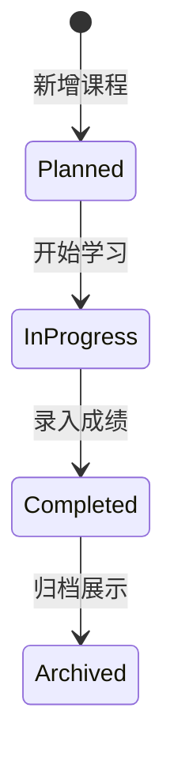
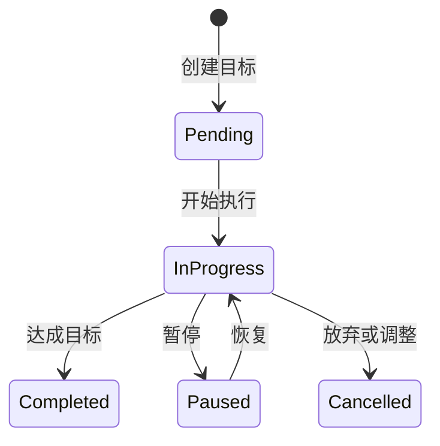
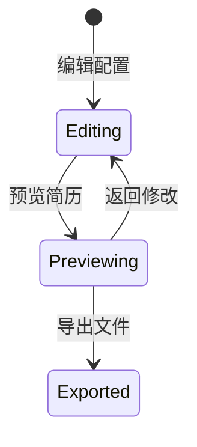

# 软件体系结构与设计模式 - 期中报告

## 项目名称：学业发展规划系统 (Personal Development Planning System)

## 项目代码托管链接

- GitHub 仓库：[https://github.com/ckhongdadada/-Qt_coursework](https://github.com/ckhongdadada/-Qt_coursework)
- 代码托管平台：GitHub
- 说明：仓库按阶段保存项目演进过程，包含源码、文档和运行说明，用于满足课程对代码托管平台链接和版本管理过程的要求。

## 一、项目概述

### 1.1 项目背景

学业发展规划系统是一个面向大学生的个人发展管理工具，旨在帮助学生系统化管理学业发展过程中的各类数据，包括课程学习、目标设定、角色经历、成果记录、活动参与、求职追踪等，并提供数据分析、简历生成、智能建议等功能。

### 1.2 需求说明

#### 1.2.1 功能性需求

| 需求编号 | 需求描述 | 来源 |
|----------|----------|------|
| FR-001 | 用户可以管理个人课程信息，包括添加、编辑、删除课程 | 用户调研 |
| FR-002 | 系统自动计算GPA和学分统计 | 核心功能需求 |
| FR-003 | 用户可以设定个人发展目标，跟踪进度 | 用户调研 |
| FR-004 | 用户可以管理角色经历（社团、实习、项目等） | 用户调研 |
| FR-005 | 用户可以记录个人成果（竞赛、证书、论文等） | 用户调研 |
| FR-006 | 系统提供数据分析功能，包括学期对比、同学对标 | 核心功能需求 |
| FR-007 | 用户可以生成个性化简历，支持多格式导出 | 用户调研 |
| FR-008 | 系统提供AI智能分析和建议功能 | 扩展功能需求 |
| FR-009 | 用户可以导入CSV数据进行批量录入 | 用户调研 |
| FR-010 | 系统支持用户注册和登录 | 基础功能需求 |

#### 1.2.2 非功能性需求

| 需求编号 | 需求描述 | 指标 |
|----------|----------|------|
| NFR-001 | 系统启动时间 | < 1秒 |
| NFR-002 | 页面响应时间 | < 500ms |
| NFR-003 | 数据存储安全性 | 密码加密存储 |
| NFR-004 | 跨平台支持 | Windows/macOS/Linux |
| NFR-005 | 代码可维护性 | 模块化设计，注释覆盖率>30% |

### 1.3 用例分析

#### 1.3.1 用例图

```
┌─────────────┐
│   用户      │
└──────┬──────┘
       │
   ┌───┴───┬──────────────┬──────────────┐
   ▼       ▼              ▼              ▼
┌──────┐┌───────┐    ┌──────────┐    ┌──────────┐
│课程管理││目标管理│    │简历生成   │    │数据分析   │
└──────┘└───────┘    └──────────┘    └──────────┘
   │       │              │              │
   ▼       ▼              ▼              ▼
 添加课程  创建目标     编辑简历      查看报告
 编辑课程  跟踪进度     预览简历      学期对比
 删除课程  设置优先级   导出简历      同学对标
```

#### 1.3.2 核心用例描述

**用例1：添加课程**

| 项 | 描述 |
|----|------|
| 用例名称 | 添加课程 |
| 参与者 | 用户 |
| 前置条件 | 用户已登录系统 |
| 后置条件 | 课程信息保存到数据库 |
| 基本流程 | 1. 用户进入课程管理页面<br>2. 点击"添加课程"<br>3. 填写课程信息<br>4. 点击"保存"<br>5. 系统验证并保存 |
| 异常流程 | 课程名称为空时提示错误 |

**用例2：生成简历**

| 项 | 描述 |
|----|------|
| 用例名称 | 生成简历 |
| 参与者 | 用户 |
| 前置条件 | 用户已登录，已有课程/经历/成果等数据 |
| 后置条件 | 生成JSON/HTML格式简历 |
| 基本流程 | 1. 用户进入简历页面<br>2. 选择简历模板<br>3. 编辑简历内容<br>4. 点击"预览"<br>5. 点击"导出"选择格式 |
| 扩展流程 | 用户可自定义简历布局 |

**用例3：查看分析报告**

| 项 | 描述 |
|----|------|
| 用例名称 | 查看分析报告 |
| 参与者 | 用户 |
| 前置条件 | 用户已登录，有课程数据 |
| 后置条件 | 显示GPA趋势和学期对比 |
| 基本流程 | 1. 用户进入分析页面<br>2. 选择学期范围<br>3. 系统生成GPA趋势图<br>4. 系统生成同学对标分析 |

### 1.4 项目目标

| 目标 | 描述 |
|------|------|
| 数据管理 | 提供课程、目标、角色、成果、经历、活动、岗位等数据的CRUD管理 |
| 数据分析 | 提供GPA计算、学期对比、同学对标等分析功能 |
| 简历生成 | 完成模块设计与原型方案，计划在后续阶段完善预览、编辑和导出体验 |
| 智能辅助 | 完成AI助手接入方案设计与基础原型，后续继续完善模型调用、建议生成和结果回填 |
| 跨平台支持 | 支持Windows桌面应用和Web浏览器访问 |

### 1.5 技术栈

| 技术 | 版本 | 用途 |
|------|------|------|
| C++ | 17 | 核心开发语言 |
| Qt6 | 6.5+ | UI框架、HTTP服务器、数据库访问 |
| SQLite | 3.x | 嵌入式关系型数据库 |
| CMake | 3.25+ | 构建系统 |
| Python | 3.10+ | AI服务后端 |

---

## 二、系统架构设计

### 2.1 整体架构

系统采用**六层分层架构**，职责明确，易于维护和扩展：

```
┌─────────────────────────────────────────────────────────────┐
│                      表现层 (Presentation)                   │
│  ┌──────────────────────────────────────────────────────┐  │
│  │  MainWindow                                           │  │
│  │  ├── Pages (OverviewPage, CoursesPage, ...)          │  │
│  │  ├── Widgets (SidebarWidget, AiPanelWidget, ...)     │  │
│  │  └── Dialogs (CourseEditorDialog, GoalEditorDialog, ...)│
│  └──────────────────────────────────────────────────────┘  │
└─────────────────────────────────────────────────────────────┘
                              │
                              ▼
┌─────────────────────────────────────────────────────────────┐
│                      控制层 (Controller)                     │
│  ┌──────────────────────────────────────────────────────┐  │
│  │  AppShellController      - 主窗口Shell控制            │  │
│  │  DataRefreshCoordinator  - 数据刷新协调               │  │
│  │  BackendRuntimeController- 后端运行时控制             │  │
│  │  AiContextMediator       - AI上下文中介               │  │
│  │  CrudPageController      - CRUD页面控制器             │  │
│  └──────────────────────────────────────────────────────┘  │
└─────────────────────────────────────────────────────────────┘
                              │
                              ▼
┌─────────────────────────────────────────────────────────────┐
│                      服务层 (Service)                        │
│  ┌──────────────────────────────────────────────────────┐  │
│  │  CourseService, GoalService, RoleService, ...        │  │
│  │  AiService, ResumeService, ImportService, ...        │  │
│  └──────────────────────────────────────────────────────┘  │
└─────────────────────────────────────────────────────────────┘
                              │
                              ▼
┌─────────────────────────────────────────────────────────────┐
│                      数据访问层 (DAO)                        │
│  ┌──────────────────────────────────────────────────────┐  │
│  │  DaoBase, CourseDao, GoalDao, RoleDao, ...           │  │
│  └──────────────────────────────────────────────────────┘  │
└─────────────────────────────────────────────────────────────┘
                              │
                              ▼
┌─────────────────────────────────────────────────────────────┐
│                      模型层 (Model)                          │
│  ┌──────────────────────────────────────────────────────┐  │
│  │  Course, Role, Achievement, Experience, ...          │  │
│  └──────────────────────────────────────────────────────┘  │
└─────────────────────────────────────────────────────────────┘
                              │
                              ▼
┌─────────────────────────────────────────────────────────────┐
│                      数据层 (Data)                           │
│  ┌──────────────────────────────────────────────────────┐  │
│  │  SQLite (pdp.db)  │  QSettings  │  JSON Files        │  │
│  └──────────────────────────────────────────────────────┘  │
└─────────────────────────────────────────────────────────────┘
```

### 2.2 分层职责

| 层次 | 目录 | 职责 | 关键类 |
|------|------|------|--------|
| **表现层** | src/client/ | UI展示、用户交互 | MainWindow, Pages, Widgets, Dialogs |
| **控制层** | src/client/core/ | 跨组件协调、状态管理 | AppShellController, DataRefreshCoordinator |
| **服务层** | src/service/ | 业务逻辑封装 | CourseService, AuthService, AiService |
| **数据访问层** | src/dao/ | 数据库CRUD操作 | DaoBase, CourseDao, UserDao |
| **模型层** | src/model/ | 数据模型定义 | Course, Role, Achievement |
| **数据层** | SQLite/QSettings | 数据持久化 | pdp.db |

### 2.3 单模式架构

系统采用纯桌面应用架构，客户端直接调用Service层：

```
┌─────────────────────────────────────┐
│      Qt Desktop Client              │
│  ┌──────────┐                       │
│  │  Pages   │ ──直接调用──→ Service │
│  └──────────┘                       │
└─────────────────────────────────────┘
```

| 特性 | 说明 |
|------|------|
| 调用方式 | 直接调用Service层 |
| 优势 | 性能高、延迟低、无需序列化 |
| 适用场景 | 本地桌面应用 |

---

## 三、模块设计

### 3.1 模块划分

| 模块 | 功能描述 | 主要文件 |
|------|----------|----------|
| **课程管理** | 课程CRUD、GPA计算、学分统计 | CoursesPage, CourseService, CourseDao |
| **目标管理** | 目标CRUD、进度跟踪、优先级管理 | GoalsPage, GoalService, GoalDao |
| **角色管理** | 角色CRUD、角色类型分类 | RolesPage, RoleService, RoleDao |
| **成果管理** | 成果CRUD、成果级别管理 | AchievementsPage, AchievementService |
| **经历管理** | 经历CRUD、时间线展示 | ExperiencesPage, ExperienceService |
| **活动管理** | 活动CRUD、活动分类 | ActivitiesPage, ActivityService |
| **岗位管理** | 岗位CRUD、需求匹配 | JobsPage, JobService, JobDao |
| **数据分析** | GPA趋势、学期对比、同学对标 | AnalysisPage, AnalyticsService |
| **简历生成** | 完成设计与原型，后续完善预览、编辑和导出流程 | ResumePage, ResumeService |
| **AI助手** | 完成接入方案与基础原型，后续完善模型调用和建议回填 | AiPanelWidget, AiService |
| **数据导入** | 完成导入流程设计与原型，后续完善校验、错误提示和批量处理 | ImportsPage, ImportService |
| **用户认证** | 注册、登录、Token管理 | AuthApi, AuthService |

### 3.2 核心协调器设计

#### 3.2.1 AppShellController

**职责**：管理主窗口Shell行为

```cpp
class AppShellController {
public:
    void onPageChanged(int index);
    void updateTopbarForPage(int index);
    void updateContentWidthForPage(int index);
};
```

#### 3.2.2 DataRefreshCoordinator

**职责**：统一管理跨页面数据刷新

```cpp
class DataRefreshCoordinator {
public:
    void bindPages(OverviewPage* overview, CoursesPage* courses, ...);
    void refreshByDomain(DataDomain domain);
    void refreshAll();
};
```

**刷新联动表**：

| 触发域 | 刷新页面 |
|--------|----------|
| 所有域 | Overview (统一刷新) |
| Courses | Analysis, Timeline, Resume |
| Goals | Analysis, Timeline, Resume |
| Roles | Analysis, Resume |
| Achievements | Analysis, Resume |
| Experiences | Analysis, Timeline, Resume |
| Activities | Analysis, Timeline, Resume |
| Jobs | Analysis, Timeline |
| All | 所有页面（导入后） |

**说明**：Overview页面在任意数据域变化时都会刷新，因此放在所有域的通用处理中。

#### 3.2.3 BackendRuntimeController

**职责**：管理后端服务生命周期

```cpp
class BackendRuntimeController {
public:
    void startBackendServer();
    void stopBackendServer();
    void insertSampleDataIfNeeded();
};
```

#### 3.2.4 AiContextMediator

**职责**：管理AI上下文传递

```cpp
class AiContextMediator {
public:
    bool eventFilter(QObject* watched, QEvent* event) override;
    void pushSelectionToPanel(const QString& text);
};
```

---

## 四、数据库设计

### 4.1 数据库选型

| 选型 | SQLite |
|------|--------|
| 类型 | 嵌入式关系型数据库 |
| 优势 | 零配置、单文件、跨平台、高性能 |
| 存储位置 | pdp.db（项目根目录） |

### 4.2 表结构设计

#### 4.2.1 课程表 (courses)

| 字段 | 类型 | 约束 | 说明 |
|------|------|------|------|
| id | INTEGER | PRIMARY KEY | 主键 |
| name | TEXT | NOT NULL | 课程名称 |
| code | TEXT | - | 课程代码 |
| credits | REAL | DEFAULT 0 | 学分 |
| semester | TEXT | - | 学期 |
| category | TEXT | DEFAULT 'Required' | 类别 |
| score | REAL | DEFAULT 0 | 分数 |
| grade_point | REAL | DEFAULT 0 | 绩点 |
| status | TEXT | DEFAULT 'Planned' | 状态 |
| teacher | TEXT | - | 教师 |
| location | TEXT | - | 地点 |
| description | TEXT | - | 描述 |
| tags | TEXT | - | 标签 |
| created_at | DATETIME | DEFAULT CURRENT_TIMESTAMP | 创建时间 |
| updated_at | DATETIME | DEFAULT CURRENT_TIMESTAMP | 更新时间 |

**索引**：code, semester, status

#### 4.2.2 角色表 (roles)

| 字段 | 类型 | 约束 | 说明 |
|------|------|------|------|
| id | INTEGER | PRIMARY KEY | 主键 |
| title | TEXT | NOT NULL | 角色标题 |
| type | TEXT | - | 角色类型 |
| organization | TEXT | - | 组织名称 |
| description | TEXT | - | 描述 |
| start_date | TEXT | - | 开始日期 |
| end_date | TEXT | - | 结束日期 |
| is_active | INTEGER | DEFAULT 1 | 是否在职 |
| achievements | TEXT | - | 成就 |
| contact | TEXT | - | 联系方式 |
| supervisor | TEXT | - | 指导老师 |
| created_at | DATETIME | DEFAULT CURRENT_TIMESTAMP | 创建时间 |
| updated_at | DATETIME | DEFAULT CURRENT_TIMESTAMP | 更新时间 |

**索引**：type, is_active

#### 4.2.3 成果表 (achievements)

| 字段 | 类型 | 约束 | 说明 |
|------|------|------|------|
| id | INTEGER | PRIMARY KEY | 主键 |
| title | TEXT | NOT NULL | 成果标题 |
| type | TEXT | - | 类型（竞赛/证书/项目/论文） |
| level | TEXT | - | 级别（国家级/省级/校级/院级） |
| organization | TEXT | - | 颁发组织 |
| description | TEXT | - | 描述 |
| date | TEXT | - | 获得日期 |
| certificate | TEXT | - | 证书编号 |
| related_course | TEXT | - | 相关课程 |
| team_members | TEXT | - | 团队成员 |
| ranking | TEXT | - | 排名 |
| prize | TEXT | - | 奖项 |
| verified | INTEGER | DEFAULT 0 | 是否验证 |
| created_at | DATETIME | DEFAULT CURRENT_TIMESTAMP | 创建时间 |
| updated_at | DATETIME | DEFAULT CURRENT_TIMESTAMP | 更新时间 |

**索引**：type, level, date

#### 4.2.4 经历表 (experiences)

| 字段 | 类型 | 约束 | 说明 |
|------|------|------|------|
| id | INTEGER | PRIMARY KEY | 主键 |
| title | TEXT | NOT NULL | 经历标题 |
| type | TEXT | - | 类型（实习/项目/研究/竞赛） |
| organization | TEXT | - | 组织 |
| role | TEXT | - | 担任角色 |
| description | TEXT | - | 描述 |
| start_date | TEXT | - | 开始日期 |
| end_date | TEXT | - | 结束日期 |
| is_ongoing | INTEGER | DEFAULT 0 | 是否进行中 |
| technologies | TEXT | - | 技术栈 |
| achievements | TEXT | - | 成果 |
| supervisor | TEXT | - | 导师 |
| contact | TEXT | - | 联系方式 |
| location | TEXT | - | 地点 |
| url | TEXT | - | 链接 |
| created_at | DATETIME | DEFAULT CURRENT_TIMESTAMP | 创建时间 |
| updated_at | DATETIME | DEFAULT CURRENT_TIMESTAMP | 更新时间 |

**索引**：type, is_ongoing

#### 4.2.5 活动表 (activities)

| 字段 | 类型 | 约束 | 说明 |
|------|------|------|------|
| id | INTEGER | PRIMARY KEY | 主键 |
| name | TEXT | NOT NULL | 活动名称 |
| description | TEXT | - | 描述 |
| category | TEXT | - | 类别 |
| start_date | TEXT | - | 开始日期 |
| end_date | TEXT | - | 结束日期 |
| is_favorite | INTEGER | DEFAULT 0 | 是否收藏 |
| is_active | INTEGER | DEFAULT 1 | 是否活跃 |
| tags | TEXT | - | 标签 |
| created_at | DATETIME | DEFAULT CURRENT_TIMESTAMP | 创建时间 |
| updated_at | DATETIME | DEFAULT CURRENT_TIMESTAMP | 更新时间 |

**索引**：start_date

#### 4.2.6 目标表 (goals)

| 字段 | 类型 | 约束 | 说明 |
|------|------|------|------|
| id | INTEGER | PRIMARY KEY | 主键 |
| title | TEXT | NOT NULL | 目标标题 |
| category | TEXT | - | 类别 |
| description | TEXT | - | 描述 |
| target_value | REAL | DEFAULT 0 | 目标值 |
| current_value | REAL | DEFAULT 0 | 当前进度 |
| unit | TEXT | - | 单位 |
| deadline | TEXT | - | 截止日期 |
| priority | TEXT | DEFAULT 'Medium' | 优先级 |
| status | TEXT | DEFAULT 'In Progress' | 状态 |
| milestones | TEXT | - | 关键节点(JSON格式) |
| created_at | DATETIME | DEFAULT CURRENT_TIMESTAMP | 创建时间 |
| updated_at | DATETIME | DEFAULT CURRENT_TIMESTAMP | 更新时间 |

**索引**：category, status, priority

#### 4.2.7 岗位表 (target_jobs)

| 字段 | 类型 | 约束 | 说明 |
|------|------|------|------|
| id | INTEGER | PRIMARY KEY | 主键 |
| title | TEXT | NOT NULL | 岗位标题 |
| company | TEXT | - | 公司 |
| location | TEXT | - | 地点 |
| salary_range | TEXT | - | 薪资范围 |
| description | TEXT | - | 描述 |
| requirements | TEXT | - | 需求列表(JSON格式) |
| is_active | INTEGER | DEFAULT 1 | 是否活跃 |
| priority | INTEGER | DEFAULT 0 | 优先级 |
| source | TEXT | - | 来源 |
| url | TEXT | - | 链接 |
| status | TEXT | - | 状态 |
| applied_date | TEXT | - | 投递日期 |
| created_at | DATETIME | DEFAULT CURRENT_TIMESTAMP | 创建时间 |
| updated_at | DATETIME | DEFAULT CURRENT_TIMESTAMP | 更新时间 |

**索引**：无

**说明**：岗位需求以JSON数组格式存储在 `requirements` 字段中，每个需求包含 `text` 和 `met` 两个属性，无需独立的关联表。

#### 4.2.8 用户表 (users)

| 字段 | 类型 | 约束 | 说明 |
|------|------|------|------|
| id | INTEGER | PRIMARY KEY | 主键 |
| username | TEXT | NOT NULL, UNIQUE | 用户名 |
| password | TEXT | NOT NULL | 密码（SHA256加密） |
| email | TEXT | UNIQUE | 邮箱 |
| display_name | TEXT | - | 显示名称 |
| role | TEXT | DEFAULT 'user' | 角色 |
| is_active | INTEGER | DEFAULT 1 | 是否激活 |
| last_login_at | TEXT | - | 最后登录 |
| created_at | DATETIME | DEFAULT CURRENT_TIMESTAMP | 创建时间 |
| updated_at | DATETIME | DEFAULT CURRENT_TIMESTAMP | 更新时间 |

**索引**：username(UNIQUE), email(UNIQUE)

#### 4.2.9 同学对比表 (peer_benchmarks)

| 字段 | 类型 | 约束 | 说明 |
|------|------|------|------|
| id | INTEGER | PRIMARY KEY | 主键 |
| name | TEXT | NOT NULL | 姓名 |
| major | TEXT | - | 专业 |
| semester | TEXT | - | 学期 |
| gpa | REAL | DEFAULT 0 | GPA |
| credits | REAL | DEFAULT 0 | 学分 |
| achievements_count | INTEGER | DEFAULT 0 | 成果数 |
| experiences_count | INTEGER | DEFAULT 0 | 经历数 |
| note | TEXT | - | 备注 |
| created_at | DATETIME | DEFAULT CURRENT_TIMESTAMP | 创建时间 |

**索引**：semester

### 4.3 ER图

```
┌──────────┐       ┌──────────┐
│  users   │       │ courses  │
└──────────┘       └──────────┘

┌──────────┐       ┌──────────┐
│  roles   │       │achievements│
└──────────┘       └──────────┘

┌──────────┐       ┌──────────┐
│experiences│      │activities│
└──────────┘       └──────────┘

┌──────────┐       ┌──────────────────┐
│  goals   │       │   target_jobs    │
└──────────┘       │ (requirements字段 │
                   │  存储JSON格式需求) │
                   └──────────────────┘

┌──────────────┐
│peer_benchmarks│
└──────────────┘
```

---

## 五、接口设计

### 5.1 RESTful API设计

#### 5.1.1 API端点列表

| 模块 | 端点 | 方法 | 功能 |
|------|------|------|------|
| **课程** | /api/courses | GET | 获取所有课程 |
| | /api/courses | POST | 创建课程 |
| | /api/courses/:id | GET | 获取单个课程 |
| | /api/courses/:id | PUT | 更新课程 |
| | /api/courses/:id | DELETE | 删除课程 |
| | /api/courses/statistics | GET | 获取统计数据 |
| **角色** | /api/roles | GET/POST | 获取/创建角色 |
| | /api/roles/:id | GET/PUT/DELETE | 操作单个角色 |
| | /api/roles/statistics | GET | 获取统计数据 |
| **成果** | /api/achievements | GET/POST | 获取/创建成果 |
| | /api/achievements/:id | GET/PUT/DELETE | 操作单个成果 |
| **经历** | /api/experiences | GET/POST | 获取/创建经历 |
| | /api/experiences/:id | GET/PUT/DELETE | 操作单个经历 |
| **活动** | /api/activities | GET/POST | 获取/创建活动 |
| | /api/activities/:id | GET/PUT/DELETE | 操作单个活动 |
| **目标** | /api/goals | GET/POST | 获取/创建目标 |
| | /api/goals/:id | GET/PUT/DELETE | 操作单个目标 |
| **岗位** | /api/jobs | GET/POST | 获取/创建岗位 |
| | /api/jobs/:id | GET/PUT/DELETE | 操作单个岗位 |
| **用户** | /api/auth/register | POST | 用户注册 |
| | /api/auth/login | POST | 用户登录 |
| | /api/auth/me | GET | 获取当前用户 |
| **分析** | /api/analytics/dashboard | GET | 仪表盘数据 |
| | /api/analytics/gpa-trend | GET | GPA趋势 |
| **简历** | /api/resume | GET | 获取简历数据 |
| | /api/resume/export | POST | 导出简历 |
| **AI** | /api/ai/chat | POST | AI对话 |
| | /api/ai/analyze | POST | AI分析 |
| **导入** | /api/import/courses | POST | 导入课程 |
| | /api/import/goals | POST | 导入目标 |

#### 5.1.2 统一响应格式

```json
{
  "success": true,
  "data": { ... },
  "message": "操作成功",
  "error": null
}
```

### 5.2 核心时序图

#### 5.2.1 用户登录流程

```
用户 → LoginDialog: 输入用户名密码
LoginDialog → AuthService: login(username, password)
AuthService → UserDao: findByUsername(username)
UserDao → SQLite: SELECT * FROM users WHERE username=?
SQLite → UserDao: 用户记录
UserDao → AuthService: User对象
AuthService → AuthService: verifyPassword(password, hash)
AuthService → AuthService: generateToken(userId, username, role)
AuthService → LoginDialog: {token, user}
LoginDialog → MainWindow: 切换到主页面
```

#### 5.2.2 添加课程流程

```
用户 → CoursesPage: 点击"添加课程"
CoursesPage → CourseEditorDialog: 打开编辑对话框
用户 → CourseEditorDialog: 填写课程信息
CourseEditorDialog → CourseService: create(course)
CourseService → CourseDao: insert(course)
CourseDao → SQLite: INSERT INTO courses ...
SQLite → CourseDao: 新记录ID
CourseDao → CourseService: Course对象
CourseService → CourseEditorDialog: {success: true}
CourseEditorDialog → CoursesPage: 关闭对话框
CoursesPage → DataRefreshCoordinator: emit dataChanged(Courses)
DataRefreshCoordinator → OverviewPage: refresh()
DataRefreshCoordinator → AnalysisPage: refresh()
```

#### 5.2.3 生成简历流程

```
用户 → ResumePage: 点击"生成简历"
ResumePage → ResumeService: generateResume(userId)
ResumeService → CourseDao: getCoursesByUser(userId)
ResumeService → ExperienceDao: getExperiencesByUser(userId)
ResumeService → AchievementDao: getAchievementsByUser(userId)
ResumeService → ResumeService: 组装简历数据
ResumeService → ResumePage: ResumeData对象
ResumePage → ResumePage: 渲染预览
用户 → ResumePage: 点击"导出"
ResumePage → ResumeService: export(format)
ResumeService → ResumeService: 生成JSON/HTML
ResumeService → ResumePage: 下载链接
```

---

## 六、核心功能状态设计

系统围绕“课程学习、目标规划、简历生成、AI建议”四类核心功能设计状态流转，便于说明对象生命周期和界面交互逻辑。

### 6.1 课程状态



| 状态 | 含义 | 触发条件 |
|---|---|---|
| Planned | 计划学习 | 新增课程但尚未开始 |
| In Progress | 学习中 | 用户标记课程正在进行 |
| Completed | 已完成 | 录入成绩并计算绩点 |
| Archived | 已归档 | 用于简历、时间轴和分析模块引用 |

### 6.2 目标状态



目标状态用于支持进度追踪、阶段提醒和分析报告生成。

### 6.3 简历生成状态



简历模块以编辑配置为单一数据源，预览和导出均基于当前配置生成，避免预览内容与导出内容不一致。
## 七、类设计

### 7.1 核心类图

```
┌─────────────────┐         ┌─────────────────┐
│   MainWindow    │◄────────│ AppShellController│
└─────────────────┘         └─────────────────┘
         │
         │ 包含
         ▼
┌─────────────────┐
│    BasePage     │◄────────┬────────┬────────┐
└─────────────────┘         │        │        │
         ▲                  │        │        │
         │                  │        │        │
    ┌────┴────┐      ┌─────┴───┐ ┌──┴───┐ ┌──┴────┐
    │CoursesPage│      │GoalsPage│ │RolesPage│ │ResumePage│
    └─────────┘      └─────────┘ └──────┘ └───────┘
         │                  │        │        │
         │ 调用              │        │        │
         ▼                  ▼        ▼        ▼
┌─────────────────────────────────────────────────┐
│              Service Layer                        │
│  ┌───────────┐ ┌───────────┐ ┌───────────────┐ │
│  │CourseService│ │GoalService│ │ ResumeService │ │
│  └───────────┘ └───────────┘ └───────────────┘ │
└─────────────────────────────────────────────────┘
         │                  │              │
         ▼                  ▼              ▼
┌─────────────────────────────────────────────────┐
│                DAO Layer                          │
│  ┌───────────┐ ┌───────────┐ ┌───────────────┐ │
│  │ CourseDao │ │  GoalDao  │ │  ResumeDao    │ │
│  └───────────┘ └───────────┘ └───────────────┘ │
└─────────────────────────────────────────────────┘
         │                  │              │
         ▼                  ▼              ▼
┌─────────────────────────────────────────────────┐
│              SQLite Database                      │
└─────────────────────────────────────────────────┘
```

### 7.2 关键类定义

#### 7.2.1 Course模型

```cpp
class Course {
public:
    int id = 0;
    QString name;
    QString code;
    double credits = 0;
    QString semester;
    QString category = "Required";
    double score = 0;
    double gradePoint = 0;
    QString status = "Planned";
    QString teacher;
    QString location;
    QString description;
    QString tags;
    QDateTime createdAt;
    QDateTime updatedAt;
    
    static double calculateGradePoint(double score, const QString& scale = "standard");
    QJsonObject toDict() const;
    static Course fromDict(const QJsonObject& obj);
};
```

#### 7.2.2 User模型

```cpp
class User {
public:
    int id = 0;
    QString username;
    QString password;
    QString email;
    QString displayName;
    QString role = "user";
    bool isActive = true;
    QString lastLoginAt;
    QDateTime createdAt;
    QDateTime updatedAt;
    
    QJsonObject toDict() const;
    static User fromDict(const QJsonObject& obj);
};
```

#### 7.2.3 DaoBase模板

```cpp
template<typename T>
class DaoBase {
public:
    virtual bool insert(T& entity) = 0;
    virtual bool update(const T& entity) = 0;
    virtual bool remove(int id) = 0;
    virtual T getById(int id) = 0;
    virtual QList<T> getAll() = 0;
};
```

---

## 八、关键技术实现

### 8.1 GPA计算算法

系统支持三种GPA计算标准：

| 标准 | 说明 | 适用场景 |
|------|------|----------|
| standard | 4.0制标准算法 | 国内高校通用 |
| 4.3 | 4.3制算法 | 部分高校使用 |
| 5.0 | 5.0制算法 | 部分高校使用 |

```cpp
static const QMap<QString, QMap<QPair<int,int>,double>> SCALE_TABLES = {
    {"standard", {{{90,100},4.0},{{85,89},3.7},{{82,84},3.3},{{78,81},3.0},{{75,77},2.7},{{72,74},2.3},{{68,71},2.0},{{64,67},1.5},{{60,63},1.0},{{0,59},0.0}}},
    {"4.3", {{{95,100},4.3},{{90,94},4.0},{{85,89},3.7},{{82,84},3.3},{{78,81},3.0},{{75,77},2.7},{{72,74},2.3},{{68,71},2.0},{{64,67},1.5},{{60,63},1.0},{{0,59},0.0}}},
    {"5.0", {{{90,100},5.0},{{85,89},4.5},{{82,84},4.0},{{78,81},3.5},{{75,77},3.0},{{72,74},2.5},{{68,71},2.0},{{64,67},1.5},{{60,63},1.0},{{0,59},0.0}}},
};

double Course::calculateGradePoint(double score, const QString& scale) {
    QString s = scale.trimmed().toLower();
    if (s.isEmpty()) s = "standard";
    if (!SCALE_TABLES.contains(s)) s = "standard";
    const auto& table = SCALE_TABLES[s];
    for (auto it = table.begin(); it != table.end(); ++it) {
        if (score >= it.key().first && score <= it.key().second) {
            return it.value();
        }
    }
    return 0.0;
}
```

### 8.2 Token认证机制

```cpp
QString AuthService::generateToken(int userId, const QString& username, const QString& role) {
    QString data = QString("%1:%2:%3:%4")
        .arg(userId).arg(username).arg(role)
        .arg(QDateTime::currentSecsSinceEpoch() + 72 * 3600);
    QByteArray hash = QCryptographicHash::hash(data.toUtf8(), QCryptographicHash::Sha256);
    return QString("%1.%2.%3")
        .arg(QString(QByteArray::number(userId).toBase64()))
        .arg(QString(username.toUtf8().toBase64()))
        .arg(QString(hash.toBase64()));
}
```

### 8.3 统一JSON响应

```cpp
class JsonUtils {
public:
    static QJsonObject success(const QJsonValue& data, const QString& message = "Success") {
        return QJsonObject{{"success", true}, {"data", data}, {"message", message}, {"error", QJsonValue()}};
    }
    static QJsonObject error(const QString& message, int code = 400) {
        return QJsonObject{{"success", false}, {"data", QJsonValue()}, {"message", message}, {"error", code}};
    }
};
```

---

## 九、设计模式应用

### 9.1 已应用的设计模式

| 模式 | 应用场景 | 实现位置 |
|------|----------|----------|
| **分层架构模式** | 六层分层架构 | 整个项目 |
| **观察者模式** | 数据变化通知页面刷新 | DataRefreshCoordinator |
| **中介者模式** | AI上下文传递 | AiContextMediator |
| **模板方法模式** | DAO基类定义CRUD模板 | DaoBase |
| **单例模式** | 服务层全局访问 | Service classes |
| **工厂模式** | 模型对象从JSON创建 | Model::fromDict |

### 9.2 计划应用的设计模式

| 模式 | 应用场景 | 计划实现 |
|------|----------|----------|
| **策略模式** | GPA计算支持多种算法 | Course::calculateGradePoint |
| **装饰器模式** | 简历导出支持多种格式 | ResumeService |
| **代理模式** | API请求统一处理 | ApiClient |

---

## 十、项目分工

### 10.1 详细设计分工

| 成员 | 职责 |
|------|------|
| **组长** | 架构设计、核心协调器、MainWindow、Qt UI页面与交互、进度管理 |
| **组员A** | API层开发、路由设计、JsonUtils、单元测试 |
| **组员B** | Model、DAO、Service层开发、业务逻辑实现 |
| **组员C** | 测试用例编写、技术文档撰写、日志系统 |

### 10.2 任务分配明细

| 任务 | 负责人 | 状态 |
|------|--------|------|
| 整体架构设计 | 组长 | ✅ 完成 |
| MainWindow实现 | 组长 | ✅ 完成 |
| 核心协调器开发 | 组长 | ✅ 完成 |
| HTTP服务器配置 | 组员A | ✅ 完成 |
| API层开发 | 组员A | ✅ 完成 |
| JsonUtils实现 | 组员A | ✅ 完成 |
| Model层设计 | 组员B | ✅ 完成 |
| DAO层实现 | 组员B | ✅ 完成 |
| Service层设计与核心实现 | 组员B | ⚠️ 核心完成，后续完善高级业务规则 |
| Qt UI页面与交互开发 | 组长 | ⚠️ 进行中 |
| 测试用例编写 | 组员C | ⏳ 待开始 |
| 技术文档撰写 | 组员C | ⚠️ 初稿完成，后续随实现继续更新 |
| 日志系统开发 | 组员C | ⚠️ 基础方案完成，后续完善运行日志与错误追踪 |

---

## 十一、时间规划与甘特图

### 11.1 阶段计划表

期中阶段的重点是完成需求分析、架构设计、数据模型设计和核心原型验证；期中之后再进入完整功能实现、测试、文档和演示准备。这样安排可以避免一开始就过早投入界面细节，同时保证体系结构设计先行。

| 阶段 | 时间安排 | 阶段目标 | 主要负责人 | 当前状态 |
|------|----------|----------|------------|----------|
| 需求分析与范围确认 | 第1周 | 明确个人发展规划系统的核心用户场景、功能边界和创新点 | 全体 | 已完成 |
| 架构设计与技术选型 | 第2周 | 确定 Qt/C++ 技术路线、分层架构、核心模块和数据流 | 组长 | 已完成 |
| 数据模型与接口设计 | 第3周 | 完成课程、目标、成果、经历、简历等核心实体设计，规划本地 HTTP API | 组员A、组员B | 已完成 |
| 核心原型实现 | 第4周 | 搭建主窗口、导航框架、数据库初始化、基础 CRUD 原型 | 组长、组员B | 进行中 |
| 期中报告整理 | 第5周 | 完成需求、架构、用例、静态设计、时序图、状态图、分工和计划说明 | 组长、组员C | 已完成 |
| 功能完善与界面优化 | 第6-7周 | 完成主要业务页面、编辑弹窗、简历原型和数据分析页面 | 组长、组员B | 计划中 |
| 高级功能与联调 | 第8周 | 完善 AI 助手、数据导入、简历导出和跨模块联动 | 全体 | 计划中 |
| 测试、文档与演示准备 | 第9-10周 | 完成回归测试、运行说明、提交包整理和演示材料 | 组员C、组长 | 计划中 |

### 11.2 甘特图

```
时间轴: 第1周  第2周  第3周  第4周  第5周  第6周  第7周  第8周  第9周  第10周

需求分析与范围确认      ████
架构设计与技术选型             ████
数据模型与接口设计                    ████
核心原型实现                               ████
期中报告整理                                      ████
功能完善与界面优化                                  ████████
高级功能与联调                                              ████
测试、文档与演示准备                                               ████████
```

---

## 十二、期中完成度总结

### 12.1 阶段性完成情况

| 类别 | 当前成果 | 阶段判断 |
|------|----------|----------|
| 需求分析 | 已完成项目主题、目标用户、核心功能和非功能需求整理 | 已完成 |
| 架构设计 | 已确定 Qt/C++ 原生桌面应用方案、分层架构和主要模块边界 | 已完成 |
| 静态设计 | 已完成模块划分、数据库表结构、ER 图和核心类图 | 基本完成 |
| 详细设计 | 已完成核心接口、关键类、主要时序图和状态流转设计 | 基本完成 |
| 核心原型 | 已搭建主窗口框架、数据层和基础业务流程 | 进行中 |
| Qt UI | 已完成页面框架与部分核心页面，交互细节仍需优化 | 进行中 |
| 高级功能 | 简历生成、AI 助手、数据导入已完成方案设计或原型验证 | 待完善 |
| 测试与文档 | 期中报告与技术解析文档初稿完成，测试计划待补充 | 待完善 |

### 12.2 后续完善计划

| 类别 | 待完成内容 | 计划完成时间 |
|------|----------|-------------|
| UI 与交互 | 完善所有业务页面、弹窗编辑、侧边栏交互和简历编辑体验 | 第6-7周 |
| 高级功能 | 将简历、AI 与导入模块从原型推进到完整可演示版本 | 第8周 |
| 数据联动 | 完善课程、目标、经历、成果、时间轴、简历之间的数据同步 | 第8周 |
| 测试调试 | 补充核心模块单元测试、集成测试和手工回归测试 | 第9周 |
| 文档与演示 | 完成期末设计报告、运行说明、提交包和演示讲稿 | 第9-10周 |

### 12.3 风险与应对

| 风险 | 影响 | 应对措施 |
|------|------|----------|
| UI 细节耗时较多 | 影响后续测试与演示准备 | 优先完成核心流程，非关键动效和美化放到后期优化 |
| 高级功能接入不稳定 | 影响 AI 助手、简历导出等展示效果 | 保留规则或本地原型方案，确保高级功能受限时也能演示主流程 |
| 测试覆盖不足 | 可能遗漏数据保存、导入、导出等边界问题 | 优先测试 CRUD、数据库初始化、简历生成和分析报告等关键路径 |
| 文档与代码不同步 | 影响报告可信度 | 每完成一个阶段同步更新报告和分工说明，避免出现旧架构描述 |
