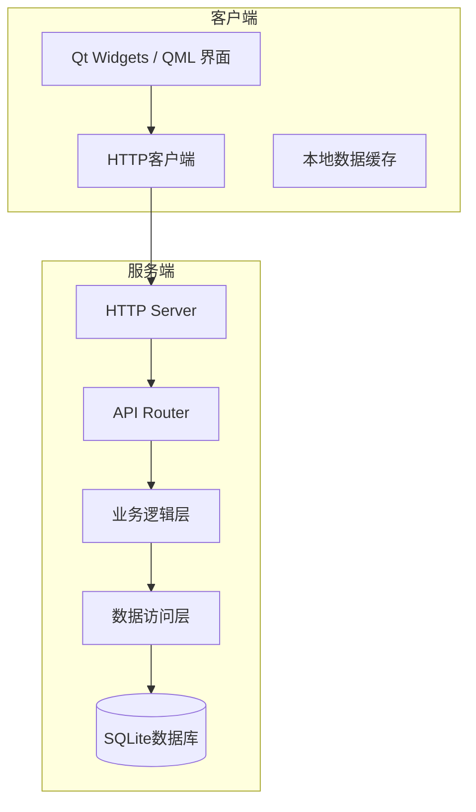

# 项目迁移至C++语言方案文档

## 一、项目概述

### 1.1 当前项目结构

| 层级 | 组件 | 技术栈 |
|------|------|--------|
| 前端 | 页面组件、路由、API调用 | Vue.js 3 + Vite + Axios |
| 后端 | API服务、业务逻辑、数据访问 | Flask + SQLAlchemy + SQLite |
| 数据层 | 数据库模型 | SQLite |

### 1.2 迁移目标

将现有的 Vue.js + Flask 架构迁移为 **Qt C++** 架构，实现：
- 统一的C++技术栈
- 跨平台支持（Windows/macOS/Linux）
- 更好的性能和资源控制
- 原生桌面应用能力

---

## 二、技术方案

### 2.1 技术选型

| 分类 | 技术 | 版本 | 选型理由 |
|------|------|------|---------|
| 框架 | Qt | 6.5+ | 成熟的C++框架，提供网络、数据库、GUI等一站式解决方案 |
| 数据库 | SQLite | 3.45+ | 轻量级嵌入式数据库，与原项目保持一致 |
| HTTP服务器 | Qt HTTP Server | 6.4+ | Qt内置HTTP服务器，无需额外依赖 |
| JSON处理 | Qt JSON | - | Qt内置JSON支持 |
| 构建工具 | CMake | 3.25+ | 跨平台构建工具，Qt官方推荐 |

### 2.2 架构设计



### 2.3 模块划分

| 模块 | 职责 | 文件结构 |
|------|------|---------|
| `server` | HTTP服务端实现 | `src/server/` |
| `api` | RESTful API路由和处理 | `src/api/` |
| `service` | 业务逻辑服务 | `src/service/` |
| `model` | 数据模型定义 | `src/model/` |
| `dao` | 数据访问对象 | `src/dao/` |
| `util` | 工具函数 | `src/util/` |
| `client` | 客户端界面（可选） | `src/client/` |

---

## 三、目录结构

```
cpp_project/                                    # 新建C++项目根目录
├── src/                                         # 源代码目录
│   ├── api/                                    # API处理层
│   │   ├── ApiRouter.cpp/.h                    # API路由分发
│   │   ├── CourseApi.cpp/.h                    # 课程API
│   │   ├── RoleApi.cpp/.h                      # 角色API
│   │   ├── AchievementApi.cpp/.h               # 成就API
│   │   ├── ExperienceApi.cpp/.h                # 经历API
│   │   ├── ActivityApi.cpp/.h                  # 活动API
│   │   ├── GoalApi.cpp/.h                      # 目标API
│   │   ├── JobApi.cpp/.h                       # 岗位API
│   │   ├── ResumeApi.cpp/.h                    # 简历API
│   │   ├── DashboardApi.cpp/.h                 # 仪表盘API
│   │   └── AnalyticsApi.cpp/.h                 # 分析API
│   ├── service/                                # 业务逻辑层
│   │   ├── CourseService.cpp/.h                # 课程服务
│   │   ├── AchievementService.cpp/.h           # 成就服务
│   │   ├── ExperienceService.cpp/.h            # 经历服务
│   │   ├── GoalService.cpp/.h                  # 目标服务
│   │   ├── AnalyticsService.cpp/.h             # 分析服务
│   │   └── ResumeService.cpp/.h                # 简历服务
│   ├── model/                                  # 数据模型
│   │   ├── Course.cpp/.h                       # 课程模型
│   │   ├── Role.cpp/.h                         # 角色模型
│   │   ├── Achievement.cpp/.h                  # 成就模型
│   │   ├── Experience.cpp/.h                   # 经历模型
│   │   ├── Activity.cpp/.h                     # 活动模型
│   │   ├── Goal.cpp/.h                         # 目标模型
│   │   ├── Job.cpp/.h                          # 岗位模型
│   │   └── JobRequirement.cpp/.h               # 岗位要求模型
│   ├── dao/                                    # 数据访问层
│   │   ├── DaoBase.cpp/.h                      # DAO基类
│   │   ├── CourseDao.cpp/.h                    # 课程DAO
│   │   ├── AchievementDao.cpp/.h               # 成就DAO
│   │   └── GoalDao.cpp/.h                      # 目标DAO
│   ├── server/                                 # HTTP服务器
│   │   ├── HttpServer.cpp/.h                   # HTTP服务器封装
│   │   └── RequestHandler.cpp/.h               # 请求处理器
│   ├── util/                                   # 工具函数
│   │   ├── JsonUtils.cpp/.h                    # JSON工具
│   │   ├── Logger.cpp/.h                       # 日志工具
│   │   └── Validator.cpp/.h                    # 验证工具
│   └── main.cpp                                # 程序入口
├── tests/                                      # 测试目录
│   ├── UnitTests.cpp                           # 单元测试
│   └── IntegrationTests.cpp                    # 集成测试
├── resources/                                  # 资源文件
│   └── schema.sql                              # 数据库初始化脚本
├── CMakeLists.txt                              # CMake配置
└── README.md                                   # 项目说明
```

---

## 四、关键模块设计

### 4.1 数据模型设计

#### 4.1.1 Course模型

```cpp
// model/Course.h
#ifndef COURSE_H
#define COURSE_H

#include <QString>
#include <QDateTime>

class Course {
public:
    int id;
    QString name;
    QString code;
    int credits;
    QString semester;
    QString category;      // Required, Elective, General
    double score;          // 百分制分数
    double gradePoint;     // 绩点
    QString status;        // Planned, InProgress, Completed
    QString teacher;
    QString location;
    QString description;
    QString tags;
    QDateTime createdAt;
    QDateTime updatedAt;

    Course();
    
    // 计算绩点
    double calculateGradePoint(double score);
    
    // 转换为JSON
    QJsonObject toJson() const;
    
    // 从JSON解析
    static Course fromJson(const QJsonObject& obj);
};

#endif // COURSE_H
```

### 4.2 DAO层设计

```cpp
// dao/CourseDao.h
#ifndef COURSEDAO_H
#define COURSEDAO_H

#include <QList>
#include "model/Course.h"

class CourseDao {
public:
    // 获取所有课程
    QList<Course> getAll() const;
    
    // 根据ID获取课程
    Course getById(int id) const;
    
    // 创建课程
    bool create(const Course& course);
    
    // 更新课程
    bool update(const Course& course);
    
    // 删除课程
    bool remove(int id);
    
    // 获取已完成课程
    QList<Course> getCompleted() const;
    
    // 根据学期获取课程
    QList<Course> getBySemester(const QString& semester) const;
};

#endif // COURSEDAO_H
```

### 4.3 API层设计

```cpp
// api/CourseApi.h
#ifndef COURSEAPI_H
#define COURSEAPI_H

#include <QHttpServerRequest>
#include <QHttpServerResponse>

class CourseApi {
public:
    // GET /api/courses
    static QHttpServerResponse getAllCourses(const QHttpServerRequest& request);
    
    // GET /api/courses/{id}
    static QHttpServerResponse getCourseById(const QHttpServerRequest& request);
    
    // POST /api/courses
    static QHttpServerResponse createCourse(const QHttpServerRequest& request);
    
    // PUT /api/courses/{id}
    static QHttpServerResponse updateCourse(const QHttpServerRequest& request);
    
    // DELETE /api/courses/{id}
    static QHttpServerResponse deleteCourse(const QHttpServerRequest& request);
};

#endif // COURSEAPI_H
```

### 4.4 服务层设计

```cpp
// service/AnalyticsService.h
#ifndef ANALYTICSSERVICE_H
#define ANALYTICSSERVICE_H

#include <QList>
#include "model/Course.h"

class AnalyticsService {
public:
    // 计算GPA
    static double calculateGpa(const QList<Course>& courses);
    
    // 生成学习建议
    QStringList generateRecommendations(double gpa, const QList<Course>& completedCourses);
    
    // 计算课程完成率
    double calculateCompletionRate(int totalCourses, int completedCourses);
    
    // 学期对比分析
    QJsonObject compareSemesters(const QString& semester1, const QString& semester2);
};

#endif // ANALYTICSSERVICE_H
```

### 4.5 HTTP服务器配置

```cpp
// server/HttpServer.h
#ifndef HTTPSERVER_H
#define HTTPSERVER_H

#include <QHttpServer>
#include <QObject>

class HttpServer : public QObject {
    Q_OBJECT
public:
    explicit HttpServer(QObject* parent = nullptr);
    
    // 启动服务器
    bool start(int port = 5000);
    
    // 停止服务器
    void stop();
    
    // 获取服务器状态
    bool isRunning() const;
    
private:
    QHttpServer m_server;
    bool m_running;
    
    // 注册API路由
    void registerRoutes();
};

#endif // HTTPSERVER_H
```

---

## 五、迁移步骤

### 5.1 阶段计划

| 阶段 | 任务 | 时长 | 负责人 |
|------|------|------|--------|
| **阶段1** | 环境搭建、基础框架 | 2天 | 组员B |
| **阶段2** | 数据模型迁移 | 3天 | 组员A |
| **阶段3** | DAO层实现 | 3天 | 组员B |
| **阶段4** | 服务层实现 | 3天 | 组员A |
| **阶段5** | API层实现 | 3天 | 组员B |
| **阶段6** | 测试与调试 | 2天 | 全体成员 |

### 5.2 详细步骤

#### 步骤1：环境搭建

```bash
# 安装Qt 6.5+（包含Qt HTTP Server模块）
# 安装CMake 3.25+
# 配置Qt环境变量

# 创建项目目录结构
mkdir -p src/{api,service,model,dao,server,util}
mkdir -p tests resources
```

#### 步骤2：数据库迁移

```sql
-- resources/schema.sql
CREATE TABLE IF NOT EXISTS courses (
    id INTEGER PRIMARY KEY AUTOINCREMENT,
    name TEXT NOT NULL,
    code TEXT,
    credits INTEGER DEFAULT 0,
    semester TEXT,
    category TEXT DEFAULT 'Required',
    score REAL,
    grade_point REAL,
    status TEXT DEFAULT 'Planned',
    teacher TEXT,
    location TEXT,
    description TEXT,
    tags TEXT,
    created_at TIMESTAMP DEFAULT CURRENT_TIMESTAMP,
    updated_at TIMESTAMP DEFAULT CURRENT_TIMESTAMP
);

-- 其他表结构...
```

#### 步骤3：模型实现

逐个实现所有数据模型的C++类，保持与原Python模型字段一致。

#### 步骤4：DAO层实现

使用Qt SQL模块实现数据访问对象，处理数据库CRUD操作。

#### 步骤5：服务层实现

迁移原Python服务层的业务逻辑到C++。

#### 步骤6：API层实现

使用Qt HTTP Server实现RESTful API接口。

#### 步骤7：测试验证

```bash
# 编译项目
mkdir build && cd build
cmake ..
make

# 运行测试
./tests/UnitTests

# 启动服务
./cpp_project
```

---

## 六、API接口对照表

| 原Flask API | 新Qt API | 方法 | 状态 |
|------------|---------|------|------|
| `/api/courses` | `/api/courses` | GET | ✅ |
| `/api/courses/<id>` | `/api/courses/{id}` | GET | ✅ |
| `/api/courses` | `/api/courses` | POST | ✅ |
| `/api/courses/<id>` | `/api/courses/{id}` | PUT | ✅ |
| `/api/courses/<id>` | `/api/courses/{id}` | DELETE | ✅ |
| `/api/roles` | `/api/roles` | GET | ✅ |
| `/api/roles` | `/api/roles` | POST | ✅ |
| `/api/achievements` | `/api/achievements` | GET | ✅ |
| `/api/achievements` | `/api/achievements` | POST | ✅ |
| `/api/dashboard/overview` | `/api/dashboard/overview` | GET | ✅ |
| `/api/goals` | `/api/goals` | GET/POST | ✅ |
| `/api/goals/<id>/progress` | `/api/goals/{id}/progress` | PUT | ✅ |
| `/api/jobs` | `/api/jobs` | GET/POST | ✅ |
| `/api/jobs/<id>/match` | `/api/jobs/{id}/match` | GET | ✅ |
| `/api/resume/export/json` | `/api/resume/export/json` | GET | ✅ |
| `/api/resume/export/pdf` | `/api/resume/export/pdf` | GET | ✅ |

---

## 七、关键技术要点

### 7.1 JSON处理

```cpp
// JSON序列化示例
QJsonObject Course::toJson() const {
    QJsonObject obj;
    obj["id"] = id;
    obj["name"] = name;
    obj["code"] = code;
    obj["credits"] = credits;
    obj["semester"] = semester;
    obj["category"] = category;
    obj["score"] = score;
    obj["gradePoint"] = gradePoint;
    obj["status"] = status;
    obj["createdAt"] = createdAt.toString(Qt::ISODate);
    obj["updatedAt"] = updatedAt.toString(Qt::ISODate);
    return obj;
}
```

### 7.2 HTTP响应封装

```cpp
// 统一响应格式
QHttpServerResponse createResponse(bool success, const QJsonValue& data, 
                                   const QString& message = "", int code = 200) {
    QJsonObject response;
    response["success"] = success;
    response["code"] = code;
    response["message"] = message;
    response["data"] = data;
    
    return QHttpServerResponse(response, QHttpServerResponse::StatusCode(code));
}
```

### 7.3 数据库连接管理

```cpp
// 数据库连接单例
class DatabaseManager {
public:
    static QSqlDatabase getInstance() {
        static QSqlDatabase db;
        if (!db.isValid()) {
            db = QSqlDatabase::addDatabase("QSQLITE");
            db.setDatabaseName("pdp.db");
            if (!db.open()) {
                qCritical() << "Database connection failed!";
            }
        }
        return db;
    }
};
```

---

## 八、注意事项

### 8.1 迁移风险点

| 风险 | 描述 | 应对措施 |
|------|------|---------|
| 类型差异 | Python动态类型 vs C++静态类型 | 仔细检查类型转换 |
| 内存管理 | C++手动内存管理 | 使用智能指针（std::unique_ptr/shared_ptr） |
| 异步处理 | Flask同步 vs Qt异步 | 使用Qt信号槽机制 |
| API兼容性 | 保持接口一致 | 使用相同的URL和响应格式 |

### 8.2 性能考虑

- 使用Qt的信号槽机制处理异步操作
- 数据库查询使用预编译语句
- 使用连接池管理数据库连接
- 考虑使用Qt Concurrent进行并行处理

### 8.3 测试策略

- 单元测试：测试各个服务类和工具函数
- 集成测试：测试API接口和数据库交互
- 性能测试：测试响应时间和并发处理能力

---

## 九、AI集成方案

### 9.1 方案概述

由于C++直接调用大语言模型较为复杂，采用**REST API调用**方案实现AI功能：

```
┌─────────────────┐     HTTP      ┌─────────────────┐
│  C++ 后端服务    │ ───────────→ │  Python AI服务   │
│  (Qt6, 端口5000) │              │  (Flask, 端口8001)│
│                 │ ←─────────── │                 │
│  AiService.cpp  │     JSON     │  ai_server.py   │
└─────────────────┘              └─────────────────┘
        │                                │
        │ 回退机制                        │ Qwen2.5-1.5B
        ▼                                ▼
┌─────────────────┐              ┌─────────────────┐
│   规则引擎模式   │              │   本地大模型     │
│  (内置规则逻辑)  │              │  (transformers) │
└─────────────────┘              └─────────────────┘
```

### 9.2 文件结构

```
cpp_project/
├── ai_server.py              # Python AI服务
├── requirements.txt          # Python依赖
├── start.bat                 # 启动脚本
├── src/
│   └── service/
│       ├── AiService.h       # AI服务头文件
│       └── AiService.cpp     # AI服务实现（HTTP调用+规则回退）
└── CMakeLists.txt            # 添加Qt6::Network依赖
```

### 9.3 核心实现

#### AiService.cpp 关键逻辑

```cpp
QJsonObject AiService::analyze(const QJsonObject& data) {
    // 1. 尝试调用AI服务
    if (isAiServerAvailable()) {
        QJsonObject result = analyzeWithAi(data);
        if (!result.contains("error")) {
            return result;  // AI分析成功
        }
    }
    
    // 2. 回退到规则引擎
    QString type = data["type"].toString("general");
    if (type == "course") return analyzeCourseFallback(data);
    if (type == "career") return analyzeCareerFallback(data);
    if (type == "goal") return analyzeGoalFallback(data);
    return analyzeGeneralFallback();
}
```

#### ai_server.py API端点

| 端点 | 方法 | 功能 |
|------|------|------|
| `/health` | GET | 健康检查 |
| `/v1/status` | GET | 获取模型状态 |
| `/v1/chat/completions` | POST | 聊天补全（OpenAI兼容格式） |
| `/v1/analyze` | POST | 学业数据分析 |

### 9.4 启动流程

```bash
# 方式1：使用启动脚本（推荐）
start.bat

# 方式2：手动启动
# 终端1：启动AI服务
python ai_server.py

# 终端2：启动C++后端
./build/pdp_server
```

### 9.5 环境配置

```bash
# 安装Python依赖
pip install -r requirements.txt

# 设置模型路径（可选，默认使用内置路径）
set AI_MODEL_PATH=C:\path\to\Qwen2.5-1.5B-Instruct
set AI_PORT=8001
```

### 9.6 AI服务状态检查

C++后端启动时会自动检测AI服务可用性：

```cpp
bool AiService::isAiServerAvailable() {
    // 发送健康检查请求
    // 超时3秒未响应则判定不可用
    // 自动回退到规则引擎模式
}
```

API响应中的 `aiPowered` 字段标识数据来源：

```json
{
    "type": "course_analysis",
    "aiPowered": true,   // true=AI分析, false=规则引擎
    "suggestions": [...]
}
```

---

## 十、桌面应用集成

### 10.1 方案概述

通过Qt WebEngine将Vue前端嵌入到C++桌面应用中，实现**单一可执行文件**的独立桌面应用：

```
┌─────────────────────────────────────────────────────┐
│              Qt 桌面应用程序 (pdp_desktop.exe)        │
│  ┌───────────────────────────────────────────────┐  │
│  │           Qt WebEngine (Chromium内核)          │  │
│  │  ┌─────────────────────────────────────────┐  │  │
│  │  │           Vue 3 前端应用                 │  │  │
│  │  │         (嵌入式Web界面)                  │  │  │
│  │  └─────────────────────────────────────────┘  │  │
│  └───────────────────────────────────────────────┘  │
│  ┌───────────────────────────────────────────────┐  │
│  │        Qt HTTP Server (后端API服务)            │  │
│  │              端口: 5000                        │  │
│  └───────────────────────────────────────────────┘  │
│  ┌───────────────────────────────────────────────┐  │
│  │           SQLite 数据库 (pdp.db)               │  │
│  └───────────────────────────────────────────────┘  │
└─────────────────────────────────────────────────────┘
```

### 10.2 文件结构

```
cpp_project/
├── src/
│   ├── client/                    # 桌面客户端（新增）
│   │   ├── MainWindow.h           # 主窗口头文件
│   │   └── MainWindow.cpp         # 主窗口实现
│   ├── main.cpp                   # 纯后端服务入口
│   └── main_desktop.cpp           # 桌面应用入口（新增）
├── resources/
│   ├── schema.sql                 # 数据库Schema
│   └── resources.qrc              # Qt资源文件
├── frontend_dist/                 # Vue构建输出（构建时生成）
├── CMakeLists.txt                 # 后端服务构建配置
├── CMakeLists_desktop.txt         # 桌面应用构建配置（新增）
├── build_frontend.bat             # 前端构建脚本（新增）
├── build_desktop.bat              # 桌面应用构建脚本（新增）
├── start_desktop.bat              # 桌面应用启动脚本（新增）
└── start.bat                      # 后端服务启动脚本
```

### 10.3 构建步骤

```bash
# 1. 设置Qt环境变量
set QT6_DIR=C:\Qt\6.6.0\mingw_64

# 2. 构建桌面应用（包含前端构建）
build_desktop.bat

# 3. 运行桌面应用
start_desktop.bat
```

### 10.4 MainWindow核心功能

| 功能 | 描述 |
|------|------|
| WebEngine视图 | 嵌入Chromium浏览器引擎渲染Vue界面 |
| 后端服务线程 | 后台启动Qt HTTP Server |
| 菜单栏 | 文件、视图、帮助菜单 |
| 工具栏 | 后退、前进、刷新、首页按钮 |
| 状态栏 | 加载进度、连接状态显示 |
| 窗口记忆 | 自动保存/恢复窗口位置和大小 |

### 10.5 两种运行模式对比

| 模式 | 启动方式 | 适用场景 |
|------|----------|----------|
| **后端服务模式** | `start.bat` | 开发调试、Web部署 |
| **桌面应用模式** | `start_desktop.bat` | 桌面分发、离线使用 |

### 10.6 依赖要求

| 依赖 | 版本 | 用途 |
|------|------|------|
| Qt6 Core | 6.4+ | 核心库 |
| Qt6 Widgets | 6.4+ | 桌面界面 |
| Qt6 WebEngineWidgets | 6.4+ | 浏览器引擎 |
| Qt6 Sql | 6.4+ | 数据库 |
| Qt6 HttpServer | 6.4+ | HTTP服务 |
| Qt6 Network | 6.4+ | 网络通信 |
| Node.js | 16+ | 前端构建 |

---

## 十一、总结

本方案提供了将Vue.js + Flask项目迁移到Qt C++的完整路线图：

1. **技术栈统一**：使用Qt框架实现前后端（或仅后端）
2. **架构保持一致**：分层架构（API层→服务层→DAO层→数据库）
3. **接口兼容性**：保持原有RESTful API接口格式
4. **迁移分步进行**：按阶段逐步迁移，降低风险
5. **AI能力集成**：通过REST API调用Python AI服务，支持规则引擎回退
6. **桌面应用支持**：通过Qt WebEngine实现独立桌面应用

### 运行方式选择

| 需求 | 推荐方式 | 命令 |
|------|----------|------|
| 开发调试 | Vue前端 + C++后端分离 | `start.bat` + `npm run dev` |
| 桌面应用 | 独立可执行文件 | `start_desktop.bat` |
| Web部署 | 仅后端服务 | `start.bat` |

建议先创建项目框架，然后逐个模块迁移，确保每个模块测试通过后再进行下一个模块。